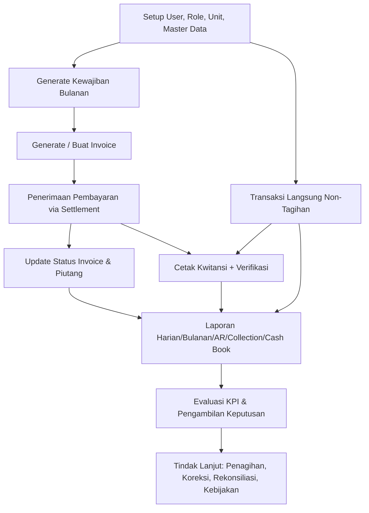

# Manual Flow Operasional Aplikasi SAKUMI (Input -> Proses -> Output Report -> Evaluasi Keputusan)

## 1. Tujuan Sistem

SAKUMI dipakai untuk mengelola keuangan sekolah per unit (MI, RA, DTA) dari data dasar sampai laporan manajerial untuk keputusan harian, mingguan, dan bulanan.

## 2. Alur Besar End-to-End

## 3. Flow Detail per Tahap

### Tahap A: Input Fondasi (Master Data)

- Input: user/role, unit aktif, siswa, kelas, kategori, fee type, fee matrix, student fee mapping.
- Proses: validasi role + unit scope (`current_unit_id`) + permission.
- Output: master data siap dipakai untuk generate kewajiban dan invoice.

### Tahap B: Generate Kewajiban Bulanan

- Input: periode bulan-tahun.
- Proses:
1. Sistem baca siswa aktif.
2. Sistem cari tarif per siswa (prioritas mapping siswa, fallback fee matrix kelas/kategori).
3. Sistem buat/update `student_obligations` (idempoten).
- Output: daftar kewajiban per siswa per bulan.

### Tahap C: Buat Invoice

- Input: kewajiban belum lunas (`student_obligations`) + due date + filter kelas/kategori (opsional).
- Proses:
1. Bisa manual (per siswa) atau massal (generate).
2. Sistem membuat invoice + invoice_items.
3. Status awal invoice: unpaid.
- Output: nomor invoice + total tagihan + jatuh tempo.

### Tahap D: Pembayaran (Settlement)

- Input: pilih siswa + invoice + nominal bayar + metode bayar.
- Proses:
1. Validasi nominal tidak melebihi outstanding.
2. Buat settlement + settlement_allocations.
3. Recalculate invoice (`unpaid` / `partially_paid` / `paid`).
4. Jika penuh, kewajiban terkait ditandai paid.
- Output: bukti settlement, outstanding berkurang, status invoice terbarui.

### Tahap E: Transaksi Langsung (Non-Settlement)

- Input: transaksi income/expense langsung (contoh pendapatan non-tagihan atau pengeluaran operasional).
- Proses:
1. Validasi item transaksi.
2. Simpan transactions + transaction_items.
3. Untuk income siswa tertentu, sistem arahkan ke settlement jika ada invoice terbuka.
- Output: transaksi kas langsung tercatat.

### Tahap F: Kwitansi dan Kontrol Cetak

- Input: transaksi yang sudah posted.
- Proses:
1. Cetak pertama = ORIGINAL.
2. Cetak ulang = COPY, wajib alasan, role terbatas.
3. Simpan log print dan kode verifikasi kwitansi.
- Output: kwitansi legal + jejak audit reprint + endpoint verifikasi.

### Tahap G: Rekonsiliasi Bank dan Expense Workflow

- Input: draft expense, mutasi bank (CSV), transaksi sistem.
- Proses:
1. Expense draft di-approve lalu diposting jadi transaksi expense.
2. Rekonsiliasi: import mutasi, match/unmatch ke transaksi.
3. Session hanya bisa ditutup jika tidak ada unmatched line.
- Output: posisi kas-bank lebih akurat + selisih terkontrol.

### Tahap H: Output Report

Jenis report utama:
- Daily Report: arus kas harian (settlement + transaksi langsung).
- Monthly Report: ringkasan bulanan + daily summary.
- AR Outstanding: daftar piutang tersisa.
- Arrears Aging: tunggakan berdasarkan bucket usia.
- Collection Report: koleksi kas berdasarkan tanggal/metode/kasir.
- Student Statement: mutasi tagihan vs pembayaran per siswa.
- Cash Book: saldo buka-tutup kas harian (cash only).
- Export: XLSX/CSV.

## 4. Evaluasi untuk Pengambilan Keputusan

### KPI Inti yang Dipakai Pimpinan

- Realisasi pendapatan hari ini dan bulan ini.
- Total tunggakan (nilai + jumlah siswa).
- Aging >90 hari (risiko tinggi).
- Selisih rekonsiliasi bank (unmatched lines).
- Pola pembatalan/void/reprint (indikasi kontrol internal).

### Contoh Keputusan Berbasis Report

1. Jika arrears >90 hari naik: jalankan prioritas penagihan per kelas/siswa.
2. Jika daily cash tidak cocok dengan fisik/bank: lakukan investigasi transaksi dan rekonsiliasi.
3. Jika expense naik tanpa tren pendapatan: tahan belanja non-prioritas.
4. Jika void/reprint tinggi: audit SOP kasir/admin.
5. Jika outstanding terkonsentrasi pada kategori tertentu: revisi kebijakan cicilan/penagihan.

## 5. Ringkas Input -> Output

- Input operasional: master data, kewajiban, invoice, pembayaran, expense, mutasi bank.
- Mesin proses: validasi role/unit, transaksi atomik, update status invoice, audit trail, cache metrics.
- Output manajemen: dashboard KPI + laporan detail + file export untuk rapat keputusan.
