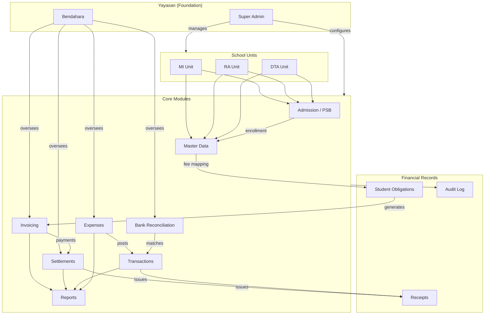
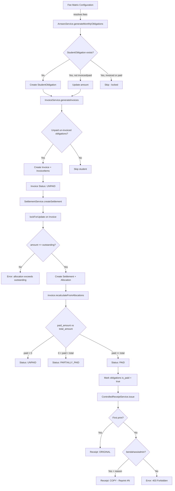
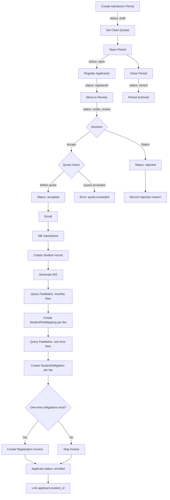
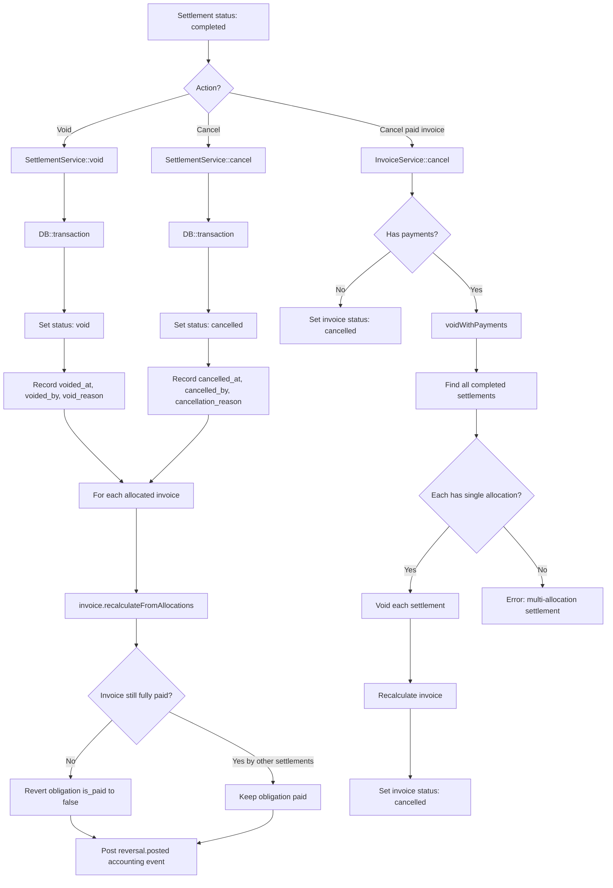
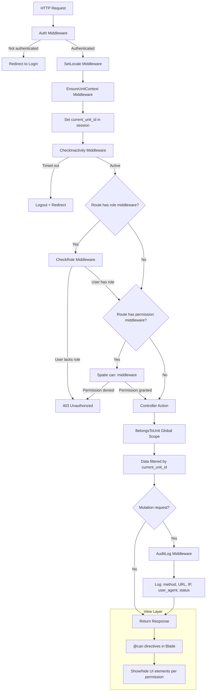
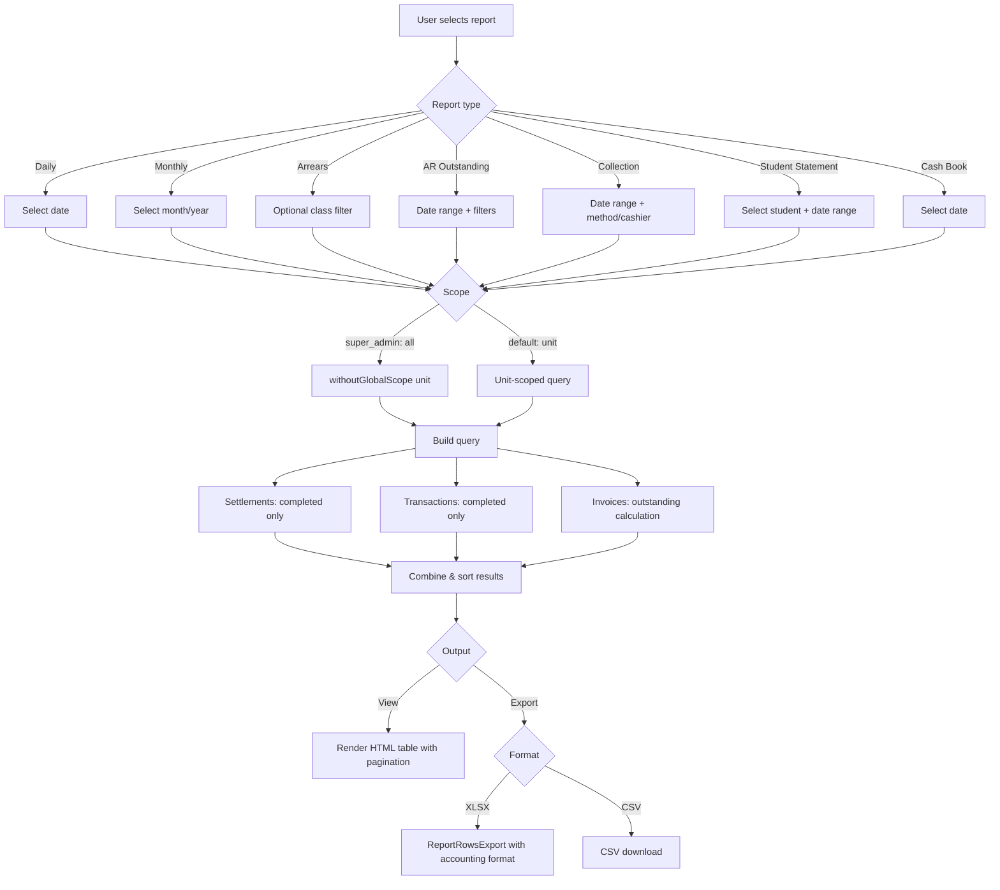
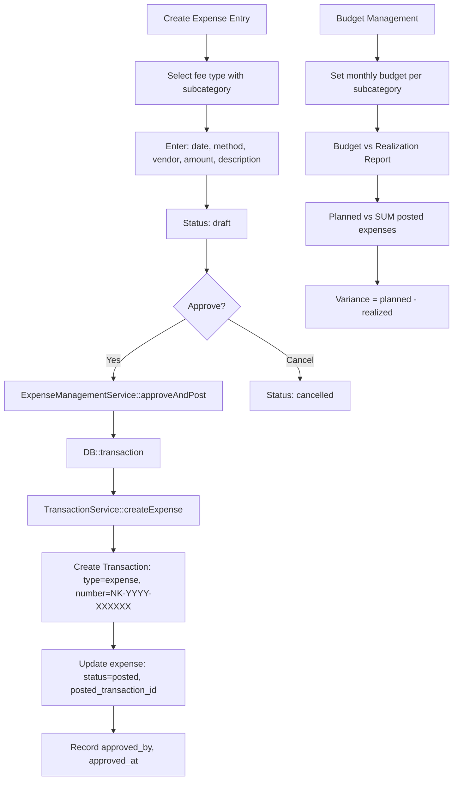
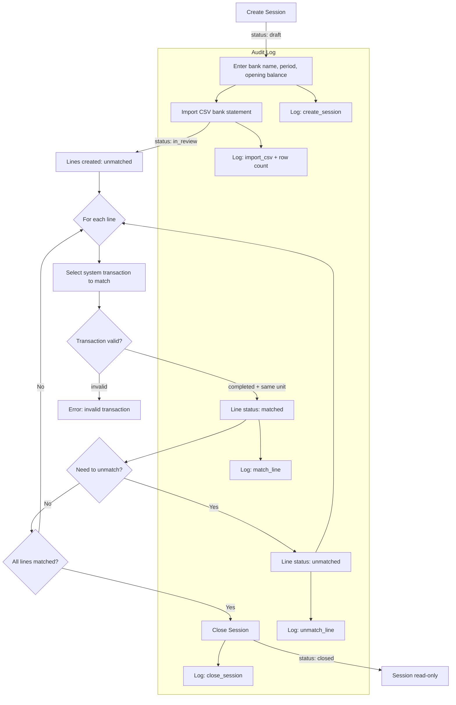

# SAKUMI Operational Handbook

> **Version:** 1.0 — Generated from codebase as-implemented
> **Date:** 2026-02-28
> **System:** SAKUMI (Sistem Administrasi Keuangan Untuk Madrasah Ibtidaiyah)
> **Stack:** Laravel + PostgreSQL + Spatie Permission + Tailwind CSS

---

## Table of Contents

1. [Executive Overview](#1-executive-overview)
2. [SOP (Standard Operating Procedure)](#2-sop-standard-operating-procedure)
3. [Juknis (Technical Guidelines)](#3-juknis-technical-guidelines)
4. [Juklak (Operational Policy)](#4-juklak-operational-policy)
5. [User Manual Per Role](#5-user-manual-per-role)
6. [Mermaid Flowcharts](#6-mermaid-flowcharts)

---

# 1. Executive Overview

## 1.1 System Purpose

SAKUMI is a multi-unit school financial administration system designed for Islamic education foundations (Yayasan) managing multiple school levels (RA/Kindergarten, MI/Primary, DTA/Diniyah). It handles student admission, fee management, invoicing, payment settlement, expense tracking, bank reconciliation, and financial reporting — all within a role-based, unit-scoped, audit-ready framework.

## 1.2 Core Financial Principles

| Principle | Implementation |
|-----------|---------------|
| **No Hard Deletes** | All financial records (Invoice, Settlement, Transaction) throw `RuntimeException` on delete. Cancellation is logical (status change). |
| **Atomic Writes** | All financial mutations are wrapped in `DB::transaction()` with pessimistic locking (`lockForUpdate()`) on invoices during allocation. |
| **Deterministic Receipts** | Verification codes are HMAC-SHA256 hashes derived from reference ID + amount + timestamp, reproducible and tamper-evident. |
| **Idempotent Generation** | Invoice and obligation generation can be re-run safely. Existing records are skipped via unique constraints. |
| **Unit Scoping** | All financial data is automatically scoped to the active unit via `BelongsToUnit` global scope trait. |
| **Immutable Completed Transactions** | PostgreSQL trigger prevents modification of `total_amount`, `transaction_date`, `student_id`, `transaction_number`, `type`, `description` on completed transactions. |

## 1.3 Current Integrity Controls

| Control | Mechanism |
|---------|-----------|
| **Concurrency** | `lockForUpdate()` on invoices during settlement creation prevents double-allocation |
| **Audit Trail** | Spatie ActivityLog on status changes + AuditLog middleware for all POST/PUT/PATCH/DELETE |
| **Receipt Control** | ControlledReceiptService tracks print count, reprint requires reason + bendahara/admin authorization |
| **Session Security** | Inactivity timeout (configurable, default 7200s), HTTPS enforcement in production |
| **Rate Limiting** | Dashboard: 120 req/min, Reports: 60 req/min, Login: 10 attempts/min per email |
| **Over-allocation Guard** | Settlement allocation validated against real-time outstanding (completed settlements only) |
| **Sequential Numbering** | Invoice/Settlement/Transaction numbers use `lockForUpdate()` for gap-free sequences |

---

# 2. SOP (Standard Operating Procedure)

## 2.1 Invoice Generation

### Prerequisites

Fee Types, Fee Matrix, and Students must be configured. Students must be active.

### Batch Generation (Monthly)

1. Navigate to **Invoices → Generate**
2. Select **Period Type**: `monthly`
3. Enter **Period Identifier**: format `YYYY-MM` (e.g., `2026-03`)
4. Optionally filter by **Class** and/or **Category**
5. Set **Due Date** (must be after today)
6. Click **Generate**

**System Process:**
1. `ArrearsService::generateMonthlyObligations()` creates/updates `StudentObligation` records for each active student based on their resolved fees (StudentFeeMapping → FeeMatrix fallback)
2. For each student with unpaid, un-invoiced obligations: creates Invoice + InvoiceItems
3. Obligations already on non-cancelled invoices are skipped (idempotent)
4. Returns summary: created / skipped / errors

### Manual Single Invoice

1. Navigate to **Invoices → Create**
2. Select **Student**
3. System loads unpaid obligations not yet invoiced
4. Select obligations to include
5. Set **Due Date** and optional **Notes**
6. Click **Create**

---

## 2.2 Settlement / Payment Recording

1. Navigate to **Settlements → Create**
2. Select **Student** — system loads outstanding invoices
3. Select **Invoice** to pay
4. Enter **Payment Date**, **Payment Method** (cash / transfer / qris)
5. Enter **Amount** (must be ≤ invoice outstanding)
6. Optionally enter **Reference Number** (for transfer/qris) and **Notes**
7. Click **Submit**

**System Process:**
1. Validates: amount ≤ outstanding, invoice belongs to student, invoice not cancelled
2. Creates Settlement record (status: `completed`)
3. Creates SettlementAllocation linking settlement to invoice
4. Calls `invoice->recalculateFromAllocations()` — updates `paid_amount` and status
5. If invoice fully paid: marks all linked StudentObligations as `is_paid = true`
6. Posts accounting engine event (if enabled)

**Partial Payments:** Supported. Invoice transitions: `unpaid` → `partially_paid` → `paid`

---

## 2.3 Receipt Issuance

### First Print (Original)

1. Open Settlement detail page
2. Click **Print**
3. System issues controlled receipt (ControlledReceiptService)
4. Receipt is marked `ORIGINAL` with verification code (16-char HMAC-SHA256)
5. Receipt contains: settlement details, student info, school identity, verification URL

### Reprint

1. Open Settlement detail page → Click **Print**
2. System detects `print_count > 0`
3. Only **bendahara** or **admin_tu_*** roles can reprint
4. User must provide reprint reason (maintenance / other with description)
5. Receipt is marked `COPY - Reprint #N`
6. Print event logged with user, timestamp, IP, device

### Public Verification

- Anyone can verify receipt at `/verify-receipt/{code}`
- Shows: settlement details, status (VALID / VOIDED), issue/print dates

---

## 2.4 Admission → Enrollment → Fee Mapping

### Phase 1: Setup Admission Period

1. Navigate to **Admission → Periods → Create**
2. Enter: name, academic year, registration open/close dates
3. Set class quotas (per target class)
4. Status starts as `draft`, change to `open` when ready

### Phase 2: Register Applicants

1. Navigate to **Admission → Applicants → Create**
2. Enter: name, target class, category, gender, birth date/place, parent info, address
3. System auto-generates registration number
4. Status: `registered`

### Phase 3: Review & Accept

1. Move applicant to review: `registered` → `under_review`
2. Accept applicant: `under_review` → `accepted` (validates class quota)
3. Or reject: `registered`/`under_review` → `rejected` (requires reason)

### Phase 4: Enroll (Critical)

1. Select accepted applicant → Click **Enroll**
2. System executes in DB transaction:
   - Creates Student record (copies all applicant data, status: `active`)
   - Generates NIS (Student ID Number)
   - Queries FeeMatrix for **monthly fees** → creates StudentFeeMapping per fee
   - Queries FeeMatrix for **one-time fees** → creates StudentObligation per fee
   - If one-time obligations exist: creates registration Invoice (period_type: `registration`, due in 30 days)
   - Links applicant to student, status: `enrolled`

---

## 2.5 Arrears Handling

**Obligation Generation:**
- Monthly obligations are auto-generated during invoice batch generation
- `ArrearsService::generateMonthlyObligations(month, year)` resolves applicable fees per student
- Fee resolution priority: StudentFeeMapping (explicit override) → FeeMatrix (class+category match) → FeeMatrix (null fallback)

**Arrears Monitoring:**
1. Navigate to **Reports → Arrears Report**
2. View aging buckets: 0-30 days, 31-60 days, 61-90 days, 90+ days
3. Filter by class, export to XLSX/CSV

**Arrears are calculated as:** Invoices where `due_date < today` AND `outstanding > 0`

---

## 2.6 Daily Reporting

1. Navigate to **Reports → Daily Report**
2. Select **Date** (defaults to today)
3. Super Admin can toggle scope: unit / all units
4. View combined settlements + direct transactions for the day
5. Export to XLSX or CSV (accounting format, negative numbers in red)

**Data shown:** Time, Source (Settlement/Direct Transaction), Code, Student, Class, Items, Amount, Net total

---

## 2.7 Bank Reconciliation

1. **Create Session:** Navigate to Bank Reconciliation → Create. Enter bank account name, period (month/year), opening balance. Status: `draft`
2. **Import Bank Statement:** Upload CSV file (columns: date, description, reference, amount, type). Status transitions to `in_review`
3. **Match Lines:** For each bank line, match to a system transaction. Line status: `unmatched` → `matched`
4. **Unmatch (if needed):** Revert a matched line to `unmatched`
5. **Close Session:** All lines must be matched. Status: `closed` (read-only). All actions logged to `bank_reconciliation_logs`

**CSV Format:** `date, description, reference, amount, type(debit/credit)`

---

# 3. Juknis (Technical Guidelines)

## 3.1 Role Permissions Matrix

**10 Roles Defined:**

| Role | Description | Permission Count |
|------|-------------|-----------------|
| `super_admin` | Full system access | ALL |
| `bendahara` | Treasurer / financial operations | 59 |
| `kepala_sekolah` | School principal / view-only oversight | 40 |
| `operator_tu` | Administrative operator / data entry | 44 |
| `admin_tu_mi` | Unit admin for MI | 50 |
| `admin_tu_ra` | Unit admin for RA | 50 |
| `admin_tu_dta` | Unit admin for DTA | 50 |
| `admin_tu` | Legacy general admin | 50 |
| `auditor` | Read-only audit access | 24 |
| `cashier` | Receipt printing & transaction entry | 3 |

### Key Permission Areas

| Area | super_admin | bendahara | kepala_sekolah | operator_tu | admin_tu_* | auditor | cashier |
|------|:-----------:|:---------:|:--------------:|:-----------:|:----------:|:-------:|:-------:|
| Dashboard | ✓ | ✓ | ✓ | ✓ | ✓ | - | ✓ |
| Transactions view | ✓ | ✓ | ✓ | ✓ | ✓ | ✓ | ✓ |
| Transactions create | ✓ | ✓ | - | ✓ | ✓ | - | ✓ |
| Transactions cancel | ✓ | ✓ | - | - | ✓ | - | - |
| Invoices view | ✓ | ✓ | ✓ | ✓ | ✓ | ✓ | - |
| Invoices create/generate | ✓ | ✓ | - | ✓ | ✓ | - | - |
| Invoices cancel | ✓ | ✓ | - | - | ✓ | - | - |
| Invoices cancel (paid) | ✓ | ✓ | - | - | ✓ | - | - |
| Settlements view | ✓ | ✓ | ✓ | ✓ | ✓ | ✓ | - |
| Settlements create | ✓ | ✓ | - | ✓ | ✓ | - | - |
| Settlements cancel | ✓ | ✓ | - | - | ✓ | - | - |
| Settlements void | ✓ | ✓ | - | - | ✓ | - | - |
| Receipts print | ✓ | ✓ | ✓ | ✓ | ✓ | ✓ | ✓ |
| Receipts reprint | ✓ | ✓ | - | - | ✓ | - | - |
| Reports (all) | ✓ | ✓ | ✓ | ✓ | ✓ | ✓ | - |
| Reports export | ✓ | ✓ | ✓ | ✓ | ✓ | ✓ | - |
| Master data view | ✓ | ✓ | ✓ | ✓ | ✓ | ✓ | - |
| Master data edit | ✓ | - | - | ✓ | ✓ | - | - |
| Fee types create/edit | ✓ | - | - | - | ✓ | - | - |
| Fee matrix manage | ✓ | ✓ | ✓ | - | ✓ | ✓ | - |
| Expenses create | ✓ | ✓ | - | - | ✓ | - | - |
| Expenses approve | ✓ | ✓ | - | - | ✓ | - | - |
| Bank recon view | ✓ | ✓ | ✓ | - | ✓ | ✓ | - |
| Bank recon manage/close | ✓ | ✓ | - | - | ✓ | - | - |
| Admission CRUD | ✓ | - | - | ✓ | ✓ | - | - |
| Admission accept/reject/enroll | ✓ | - | - | ✓ | ✓ | - | - |
| Users manage | ✓ | - | - | - | - | - | - |
| Settings edit | ✓ | - | - | - | - | - | - |
| Audit log view | ✓ | ✓ | ✓ | - | ✓ | ✓ | - |

---

## 3.2 Status Transitions

### Invoice Status

| From | To | Trigger | Condition |
|------|----|---------|-----------|
| `unpaid` | `partially_paid` | Settlement allocated | `0 < paid_amount < total_amount` |
| `unpaid` | `paid` | Settlement allocated | `paid_amount >= total_amount` |
| `partially_paid` | `paid` | Settlement allocated | `paid_amount >= total_amount` |
| `paid` | `partially_paid` | Settlement voided/cancelled | Recalculated `paid_amount < total_amount` |
| `partially_paid` | `unpaid` | Settlement voided/cancelled | Recalculated `paid_amount <= 0` |
| `unpaid` | `cancelled` | Manual cancel | No payments (paid_amount = 0) |
| `paid`/`partially_paid` | `cancelled` | Cancel with void | Requires `invoices.cancel_paid` + `settlements.void` permissions; all linked settlements must have single allocation |

### Settlement Status

| From | To | Method | Who Can Do |
|------|----|--------|-----------|
| `completed` | `void` | `SettlementService::void()` | `settlements.void` permission |
| `completed` | `cancelled` | `SettlementService::cancel()` | `settlements.cancel` permission |

Both `void` and `cancelled` are **terminal states** — no further transitions possible.

### Applicant Status

| From | To | Action | Permission |
|------|----|--------|-----------|
| `registered` | `under_review` | Move to review | `admission.applicants.review` |
| `under_review` | `accepted` | Accept (checks quota) | `admission.applicants.accept` |
| `registered` or `under_review` | `rejected` | Reject (requires reason) | `admission.applicants.reject` |
| `accepted` | `enrolled` | Enroll (creates student) | `admission.applicants.enroll` |

### Admission Period Status

| From | To | Trigger |
|------|----|---------|
| `draft` | `open` | Manual status change |
| `open` | `closed` | Manual status change |

### Expense Entry Status

| From | To | Trigger |
|------|----|---------|
| `draft` | `posted` | Approve and post (creates Transaction) |
| `draft` | `cancelled` | Cancel entry |

### Bank Reconciliation Session Status

| From | To | Trigger |
|------|----|---------|
| `draft` | `in_review` | After first CSV import |
| `in_review` | `closed` | All lines matched, close session |

---

## 3.3 Validation Rules

### Settlement Creation

| Rule | Implementation |
|------|---------------|
| Amount > 0 | `'amount' => 'required|numeric|min:1'` |
| Amount ≤ Outstanding | Controller validates `$amount <= $outstanding` |
| Invoice not cancelled | Service validates `status != 'cancelled'` |
| Invoice belongs to student | `WHERE student_id = $studentId AND unit_id = $unitId` |
| No over-allocation (BR-06) | Sum of allocations ≤ settlement total_amount |
| Student consistency (BR-07) | Each invoice.student_id must match settlement student_id |
| Pessimistic lock | `Invoice::lockForUpdate()` during allocation |

### Invoice Creation

| Rule | Implementation |
|------|---------------|
| Obligations belong to student | Validated before creation |
| Obligations not paid | `is_paid = false` |
| Obligations not on active invoice | Excludes obligations on non-cancelled invoices |
| Due date after today | `'due_date' => 'required|date|after:today'` |
| Period format | Monthly: `YYYY-MM`, Registration: `REG-{year}` |

### Admission Enrollment

| Rule | Implementation |
|------|---------------|
| Status must be `accepted` | Validated before enroll |
| Class quota not exceeded | Count of accepted+enrolled < quota |
| Applicant not already enrolled | `student_id` must be null |

---

## 3.4 Data Edit Restrictions

| Record Type | Restriction |
|-------------|------------|
| **Completed Transaction** | PostgreSQL immutability trigger prevents changes to: `total_amount`, `transaction_date`, `student_id`, `transaction_number`, `type`, `description` |
| **Invoice** | Hard delete throws RuntimeException. Cancel only via status change. Paid invoices require settlement void first. |
| **Settlement** | Hard delete throws RuntimeException. Void/cancel only via status change. Terminal states cannot be changed. |
| **StudentObligation** | Amount can be updated only if NOT yet invoiced AND NOT yet paid (tariff correction window) |
| **Enrolled Applicant** | Cannot be edited or deleted once status is `enrolled` |
| **Closed Bank Recon Session** | Read-only after close — no imports, matches, or modifications |

---

## 3.5 DB Transaction Usage

| Operation | Transaction Scope | Locking |
|-----------|------------------|---------|
| Invoice generation (per student) | `DB::transaction` around invoice + items creation | None |
| Invoice number generation | `lockForUpdate()` on last invoice in unit/year | Pessimistic |
| Settlement creation | `DB::transaction` around settlement + allocations + invoice recalc + obligation updates | `lockForUpdate()` on invoices |
| Settlement number generation | `lockForUpdate()` on last settlement | Pessimistic |
| Settlement void | `DB::transaction` around status update + invoice recalc + obligation revert | None |
| Settlement cancel | `DB::transaction` around status update + invoice recalc + obligation revert | None |
| Invoice cancel with payments | `DB::transaction` around settlement voids + invoice recalc + status update | None |
| Transaction creation | `DB::transaction` around transaction + items + accounting event | `lockForUpdate()` on last transaction |
| Applicant enrollment | `DB::transaction` around student creation + fee mapping + obligation + invoice | None |
| Expense approve & post | `DB::transaction` around expense update + transaction creation | None |
| Bank recon close | `DB::transaction` around status update + validation | None |

---

# 4. Juklak (Operational Policy)

## 4.1 Role Responsibilities

| Role | Primary Responsibilities |
|------|------------------------|
| **super_admin** | System configuration, user management, role assignment, all unit access, settings, backup, health monitoring, permanent deletion |
| **bendahara** | Financial oversight across units, settlement creation/void, invoice management, expense approval, bank reconciliation, all reports, receipt reprint authorization |
| **kepala_sekolah** | View-only access to all financial data, all reports, student data. Cannot create, modify, or delete any records. Oversight and monitoring role. |
| **admin_tu_mi/ra/dta** | Full operational management within assigned unit: admission, student management, fee configuration, invoicing, settlement, expense management, bank reconciliation, reports |
| **operator_tu** | Data entry: student registration, admission processing, invoice generation, settlement recording. Limited to create/view, cannot cancel or void. |
| **auditor** | Read-only access to all financial records, all reports with export capability, audit log access. Cannot modify any data. |
| **cashier** | Minimal access: view transactions, create transactions, print receipts (first print only). Cannot reprint, cannot access invoices/settlements/reports. |

---

## 4.2 What Cannot Be Modified and When

| Scenario | Restriction | Rationale |
|----------|------------|-----------|
| Transaction is `completed` | Core fields immutable (DB trigger) | Prevents post-facto tampering |
| Invoice has payments (`paid_amount > 0`) | Cannot cancel without voiding all settlements first | Prevents orphaned payments |
| Settlement is `void` or `cancelled` | Terminal state — no further changes | Maintains audit integrity |
| Obligation is on active invoice | Amount cannot be updated | Prevents invoice/obligation mismatch |
| Obligation is paid | Amount cannot be updated | Prevents paid amount discrepancy |
| Bank recon session is `closed` | Entire session is read-only | Period is finalized |
| Applicant is `enrolled` | Cannot edit or delete applicant | Student record already created |
| User modifying own role | Blocked by RestrictRoleManagement middleware | Prevents privilege escalation |

---

## 4.3 Escalation Procedures

| Situation | Required Action | Required Role |
|-----------|----------------|---------------|
| Cancel paid invoice | Void all linked settlements first, then cancel invoice | `invoices.cancel_paid` + `settlements.void` (bendahara/admin_tu) |
| Reprint receipt | Provide reason (maintenance/other), only bendahara/admin can authorize | `receipts.reprint` (bendahara/admin_tu) |
| Multi-allocation settlement cancel | Cannot auto-cancel if settlement has >1 allocation. Must void settlements individually first | `settlements.void` |
| Permanent data deletion | Requires `dangerous_permanent_delete_enabled` setting + super_admin role | `super_admin` only |
| User role changes | Only super_admin can assign/modify roles | `users.manage-roles` (super_admin) |
| Unit switching | Only super_admin and bendahara can switch between units | Role check in UnitSwitchController |

---

## 4.4 Reversal / Void Rules

### Settlement Void vs Cancel

| Aspect | Void | Cancel |
|--------|------|--------|
| Status | `void` | `cancelled` |
| Permission | `settlements.void` | `settlements.cancel` |
| Accounting | Posts `reversal.posted` event | Posts `reversal.posted` event |
| Effect on invoice | Recalculates paid_amount, may revert status | Same |
| Effect on obligations | Reverts `is_paid` to false if no other covering settlement | Same |
| Metadata stored | `voided_at`, `voided_by`, `void_reason` | `cancelled_at`, `cancelled_by`, `cancellation_reason` |

### Invoice Cancel with Payments — Single-Allocation Rule

- System finds all completed settlements allocated to the invoice
- Each settlement must have **exactly 1 allocation** (only this invoice)
- If any settlement has multiple allocations: operation fails, manual void required
- This prevents ambiguous partial reversals

---

# 5. User Manual Per Role

## 5.1 Bendahara (Treasurer)

### Record a Payment

1. Menu: **Settlements** → **Create**
2. Select student from dropdown (shows active students)
3. System shows outstanding invoices with remaining balance
4. Select invoice, enter amount, payment method, date
5. For transfer/qris: enter reference number
6. Submit → settlement created, invoice updated, receipt ready to print

### Void a Settlement

1. Menu: **Settlements** → find settlement → open detail
2. Click **Void**
3. Enter void reason (required, max 1000 chars)
4. Confirm → settlement voided, invoice recalculated, obligations reverted

### View Reports

1. Menu: **Reports** → select report type
2. Apply filters (date, class, student, payment method)
3. View on screen or click **Export** for XLSX/CSV

### Manage Bank Reconciliation

1. Menu: **Bank Reconciliation** → **Create**
2. Enter bank name, period, opening balance
3. Import CSV bank statement
4. Match each line to system transactions
5. Close session when all matched

### Expected Outcomes

- Settlement creates `completed` record, updates invoice `paid_amount`
- Void reverts invoice status and obligation paid flags
- Reports show real-time financial data filtered by date/scope

### Common Errors

- "Allocation exceeds outstanding" → amount entered exceeds remaining invoice balance
- "Invoice has no balance" → invoice already fully paid
- "Settlement has multiple allocations" → cannot auto-void; void individually

---

## 5.2 Operator TU (Administrative Operator)

### Register New Applicant (PSB)

1. Menu: **Admission → Applicants → Create**
2. Select admission period (must be `open`)
3. Fill in: name, target class, category, gender, birth date/place, parent details, address
4. Submit → applicant registered with auto-generated registration number

### Process Admission

1. Find applicant → Click **Review** (registered → under_review)
2. Click **Accept** (validates quota) or **Reject** (enter reason)
3. For accepted: Click **Enroll** → student created with fees automatically mapped

### Generate Monthly Invoices

1. Menu: **Invoices → Generate**
2. Select period type: `monthly`, enter period: `YYYY-MM`
3. Optionally filter by class/category
4. Set due date → Click Generate
5. Review summary: X created, Y skipped, any errors

### Record Payment

1. Menu: **Settlements → Create**
2. Select student → select invoice → enter amount and method
3. Submit

### Screens Used

Admission (Periods, Applicants), Master Data (Students, Classes, Categories), Invoices, Settlements, Reports

### Common Errors

- "Quota exceeded" → class has reached maximum accepted+enrolled count
- "No unpaid obligations" → all obligations already invoiced for the period
- "Obligation already on invoice" → invoice already exists for this period/student

---

## 5.3 Kepala Sekolah (School Principal)

### Monitor Financial Status

1. Login → **Dashboard** shows: today's income, month income, total arrears
2. Super admin scope toggle available for consolidated view

### Review Reports

1. Menu: **Reports** → Select: Daily, Monthly, Arrears, AR Outstanding, Collection, Student Statement, Cash Book
2. Apply date/class/student filters
3. Export to XLSX/CSV for offline review

### View Student Data

1. Menu: **Master Data → Students** → browse/search
2. View student details including class, category, fee mappings

**Key Limitation:** View-only access. Cannot create, edit, or delete any records. For changes, escalate to admin_tu or bendahara.

---

## 5.4 Auditor

### Audit Financial Records

1. Login → Access all financial modules in read-only mode
2. Review: Transactions, Invoices, Settlements, Expenses
3. Access audit log via Settings → Audit Log

### Generate Audit Reports

1. Menu: **Reports** → any report type
2. Export all reports to XLSX/CSV for analysis
3. Cross-reference: Daily Report totals ↔ Monthly Report ↔ Cash Book
4. Verify: Arrears aging buckets ↔ AR Outstanding totals
5. Check: Student Statement opening/closing balances

**Key Access:** All view + export permissions, audit log, no create/edit/delete on any module.

---

## 5.5 Cashier

### Record Direct Transaction

1. Menu: **Transactions → Create**
2. Select type: income
3. Select student (optional), fee type, amount, payment method
4. Submit → transaction created, receipt auto-generated

### Print Receipt

1. Open transaction detail → Click **Print**
2. First print: receipt marked `ORIGINAL`
3. Reprint: **not authorized** for cashier role → escalate to bendahara/admin

**Key Limitation:** Cannot access invoices, settlements, reports, master data, or expenses. Minimal access for transaction recording and receipt printing only.

---

## 5.6 Super Admin

### Manage Users

1. Menu: **Users → Create** — set name, email, password, role, unit
2. Edit users: change role, reset password, toggle active status
3. Bulk status update for multiple users

### Configure System

1. Menu: **Settings** → update academic year, receipt footer, school identity
2. Toggle `dangerous_permanent_delete_enabled` for data cleanup
3. Configure unit-specific school names/addresses

### Monitor All Units

1. Dashboard with `scope=all` for consolidated view
2. Unit switcher in navigation bar to access specific units
3. All reports support consolidated scope

**Key Capabilities:** All permissions, cross-unit access, user/role management, settings, backup, health check, permanent deletion.

---

# 6. Mermaid Flowcharts

## 6.1 System Overview

## 6.2 Financial Flow (Invoice → Settlement → Receipt)

## 6.3 Admission Flow

## 6.4 Settlement Void / Cancel Flow

## 6.5 Permission / Authorization Flow

## 6.6 Report System Flow

## 6.7 Expense Management Flow

## 6.8 Bank Reconciliation Flow

---

# Appendix A: Number Format Reference

| Record | Format | Example |
|--------|--------|---------|
| Invoice | `INV-{UNITCODE}-{YYYY}-{000001}` | `INV-MI-2026-000042` |
| Settlement | `STL-{YYYY}-{000001}` | `STL-2026-000103` |
| Income Transaction | `NF-{YYYY}-{000001}` | `NF-2026-000015` |
| Expense Transaction | `NK-{YYYY}-{000001}` | `NK-2026-000008` |
| Verification Code | 16-char uppercase hex (HMAC-SHA256) | `A3F8B2C1D4E5F6A7` |

# Appendix B: Payment Methods

| Code | Label |
|------|-------|
| `cash` | Cash |
| `transfer` | Bank Transfer |
| `qris` | QRIS |

# Appendix C: Report Summary

| Report | Data Source | Key Metric | Export |
|--------|-----------|-----------|--------|
| Daily | Settlements + Transactions | Net cash movement per day | XLSX, CSV |
| Monthly | Settlements + Transactions | Daily summaries for month | XLSX, CSV |
| Arrears | Invoices (overdue) | Aging buckets (0-30, 31-60, 61-90, 90+) | XLSX, CSV |
| AR Outstanding | Invoices (date range) | Total outstanding | XLSX, CSV |
| Collection | Settlements + Transactions | Income vs expense | XLSX, CSV |
| Student Statement | Invoices + Settlements (per student) | Opening/closing balance | XLSX, CSV |
| Cash Book | Cash-only transactions | Running cash balance | XLSX, CSV |

---

> **Document generated from SAKUMI codebase as-implemented.**
> **No logic changes, redesigns, or improvements proposed.**
> **All flows reflect actual implemented behavior.**
