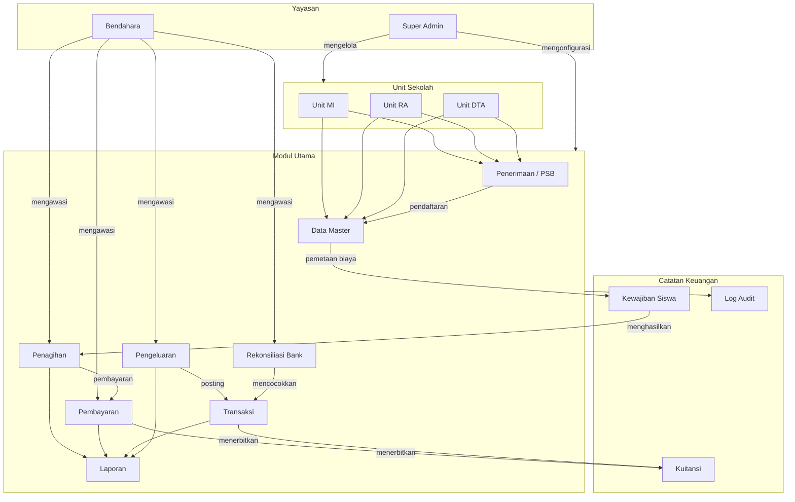
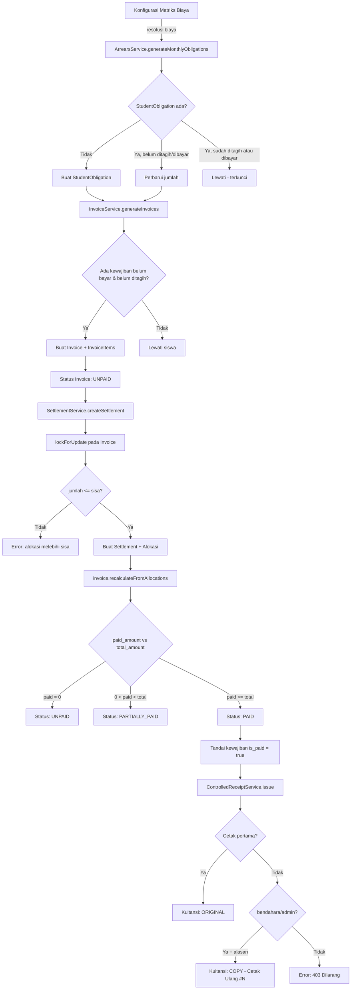
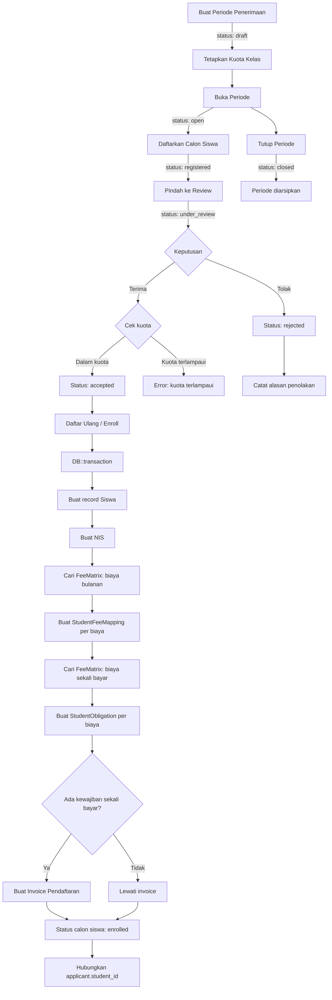
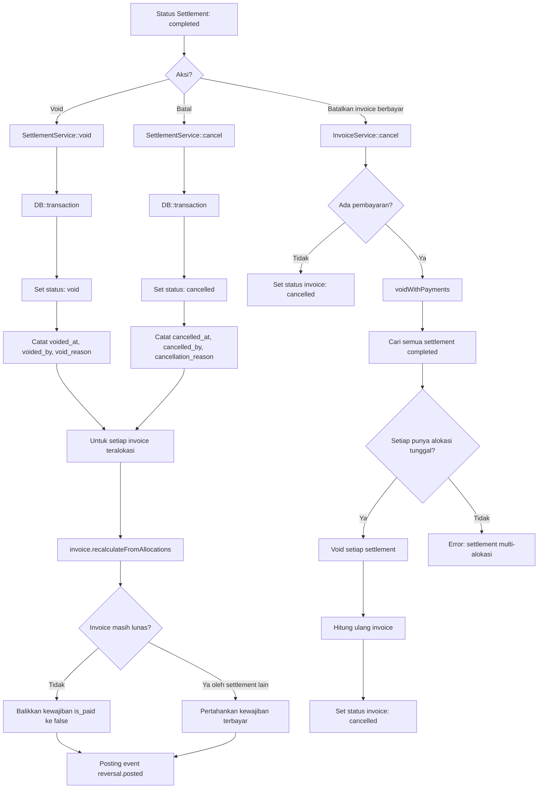
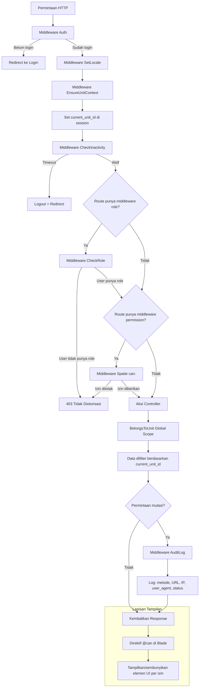
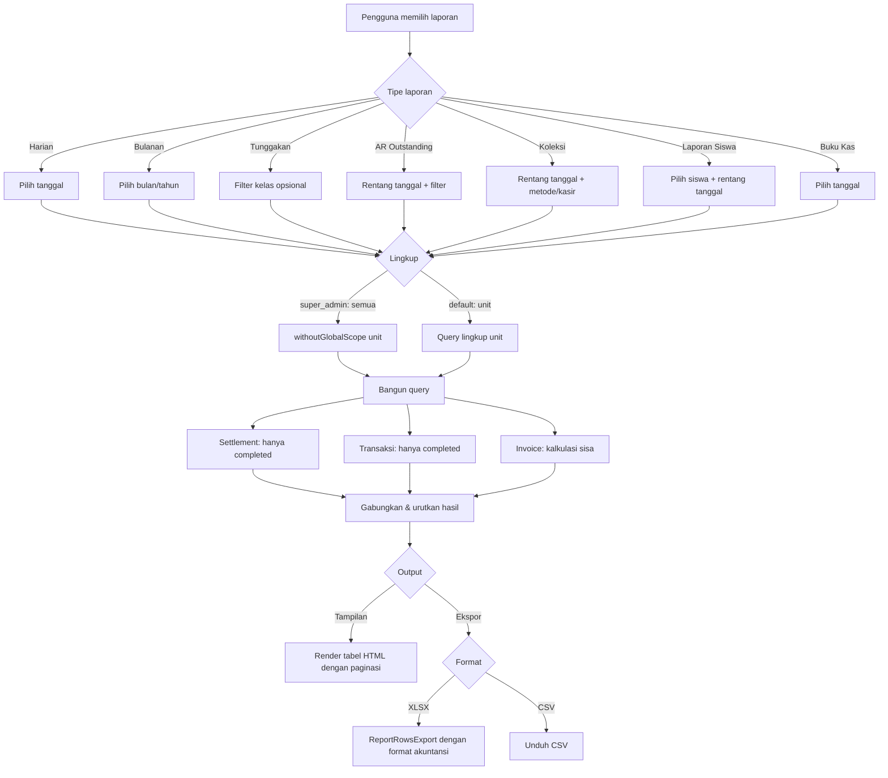
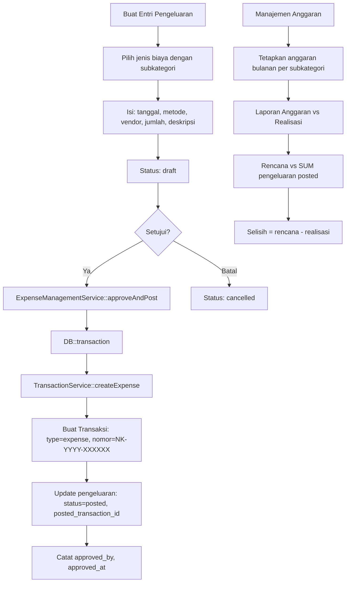
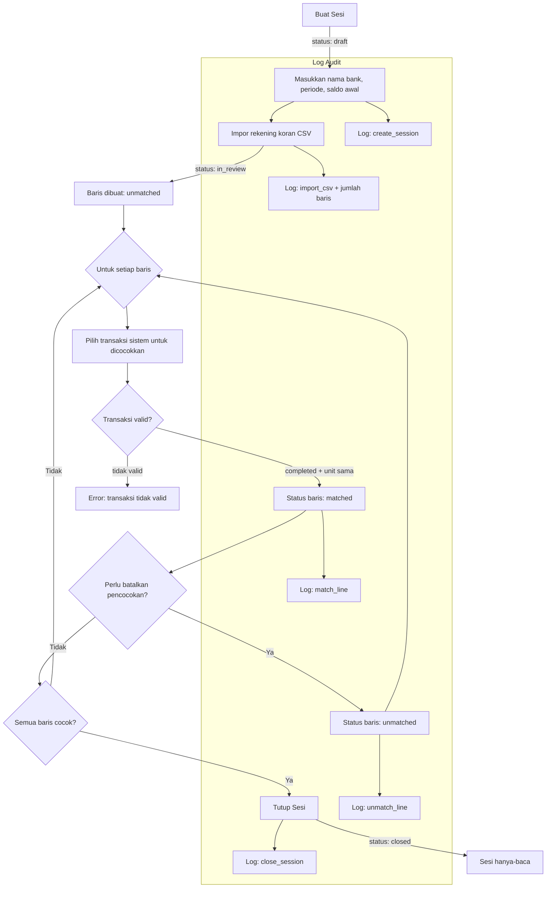

# Buku Panduan Operasional SAKUMI

> **Versi:** 1.0 — Dibuat dari codebase sebagaimana diimplementasikan
> **Tanggal:** 2026-02-28
> **Sistem:** SAKUMI (Sistem Administrasi Keuangan Untuk Madrasah Ibtidaiyah)
> **Stack:** Laravel + PostgreSQL + Spatie Permission + Tailwind CSS

---

## Daftar Isi

1. [Ringkasan Eksekutif](#1-ringkasan-eksekutif)
2. [SOP (Prosedur Operasi Standar)](#2-sop-prosedur-operasi-standar)
3. [Juknis (Petunjuk Teknis)](#3-juknis-petunjuk-teknis)
4. [Juklak (Petunjuk Pelaksanaan)](#4-juklak-petunjuk-pelaksanaan)
5. [Panduan Pengguna Per Peran](#5-panduan-pengguna-per-peran)
6. [Diagram Alur Mermaid](#6-diagram-alur-mermaid)

---

# 1. Ringkasan Eksekutif

## 1.1 Tujuan Sistem

SAKUMI adalah sistem administrasi keuangan sekolah multi-unit yang dirancang untuk yayasan pendidikan Islam yang mengelola beberapa jenjang (RA, MI, DTA). Sistem ini menangani penerimaan siswa baru, pengelolaan biaya, penagihan, pencatatan pembayaran, pelacakan pengeluaran, rekonsiliasi bank, dan pelaporan keuangan — seluruhnya dalam kerangka berbasis peran, lingkup unit, dan siap audit.

## 1.2 Prinsip Keuangan Utama

| Prinsip | Implementasi |
|---------|-------------|
| **Tanpa Hapus Permanen** | Semua catatan keuangan (Invoice, Settlement, Transaction) memunculkan `RuntimeException` saat dihapus. Pembatalan bersifat logis (perubahan status). |
| **Penulisan Atomik** | Semua mutasi keuangan dibungkus dalam `DB::transaction()` dengan penguncian pesimistik (`lockForUpdate()`) pada invoice saat alokasi. |
| **Kuitansi Deterministik** | Kode verifikasi adalah hash HMAC-SHA256 dari ID referensi + jumlah + timestamp, dapat direproduksi dan tahan manipulasi. |
| **Pembuatan Idempoten** | Pembuatan invoice dan kewajiban dapat dijalankan ulang dengan aman. Record yang sudah ada dilewati via unique constraint. |
| **Lingkup Unit** | Semua data keuangan secara otomatis dibatasi pada unit aktif melalui trait global scope `BelongsToUnit`. |
| **Transaksi Selesai Tidak Dapat Diubah** | Trigger PostgreSQL mencegah modifikasi `total_amount`, `transaction_date`, `student_id`, `transaction_number`, `type`, `description` pada transaksi yang sudah selesai. |

## 1.3 Kontrol Integritas Saat Ini

| Kontrol | Mekanisme |
|---------|-----------|
| **Konkurensi** | `lockForUpdate()` pada invoice saat pembuatan settlement mencegah alokasi ganda |
| **Jejak Audit** | Spatie ActivityLog pada perubahan status + AuditLog middleware untuk semua POST/PUT/PATCH/DELETE |
| **Kontrol Kuitansi** | ControlledReceiptService melacak jumlah cetak, cetak ulang memerlukan alasan + otorisasi bendahara/admin |
| **Keamanan Sesi** | Timeout tidak aktif (dapat dikonfigurasi, default 7200 detik), penegakan HTTPS di produksi |
| **Pembatasan Laju** | Dashboard: 120 req/menit, Laporan: 60 req/menit, Login: 10 percobaan/menit per email |
| **Penjaga Alokasi Berlebih** | Alokasi settlement divalidasi terhadap saldo terutang real-time (hanya settlement completed) |
| **Penomoran Berurutan** | Nomor Invoice/Settlement/Transaction menggunakan `lockForUpdate()` untuk urutan tanpa gap |

---

# 2. SOP (Prosedur Operasi Standar)

## 2.1 Pembuatan Invoice

### Prasyarat

Jenis Biaya, Matriks Biaya, dan Siswa harus sudah dikonfigurasi. Siswa harus berstatus aktif.

### Pembuatan Batch (Bulanan)

1. Buka **Tagihan → Generate**
2. Pilih **Tipe Periode**: `monthly`
3. Masukkan **Identifier Periode**: format `YYYY-MM` (misal `2026-03`)
4. Opsional filter berdasarkan **Kelas** dan/atau **Kategori**
5. Tetapkan **Tanggal Jatuh Tempo** (harus setelah hari ini)
6. Klik **Generate**

**Proses Sistem:**
1. `ArrearsService::generateMonthlyObligations()` membuat/memperbarui record `StudentObligation` untuk setiap siswa aktif berdasarkan biaya yang berlaku (StudentFeeMapping → fallback FeeMatrix)
2. Untuk setiap siswa dengan kewajiban belum bayar dan belum ditagih: membuat Invoice + InvoiceItems
3. Kewajiban yang sudah ada di invoice non-cancelled dilewati (idempoten)
4. Mengembalikan ringkasan: dibuat / dilewati / error

### Invoice Manual Tunggal

1. Buka **Tagihan → Buat**
2. Pilih **Siswa**
3. Sistem memuat kewajiban belum bayar yang belum ditagih
4. Pilih kewajiban yang akan dimasukkan
5. Tetapkan **Tanggal Jatuh Tempo** dan **Catatan** opsional
6. Klik **Buat**

---

## 2.2 Pencatatan Pembayaran (Settlement)

1. Buka **Pembayaran → Buat**
2. Pilih **Siswa** — sistem memuat tagihan yang belum lunas
3. Pilih **Invoice** yang akan dibayar
4. Masukkan **Tanggal Bayar**, **Metode Pembayaran** (tunai / transfer / qris)
5. Masukkan **Jumlah** (harus ≤ sisa tagihan)
6. Opsional masukkan **Nomor Referensi** (untuk transfer/qris) dan **Catatan**
7. Klik **Submit**

**Proses Sistem:**
1. Validasi: jumlah ≤ sisa, invoice milik siswa, invoice tidak dibatalkan
2. Membuat record Settlement (status: `completed`)
3. Membuat SettlementAllocation menghubungkan settlement ke invoice
4. Memanggil `invoice->recalculateFromAllocations()` — memperbarui `paid_amount` dan status
5. Jika invoice lunas: menandai semua StudentObligation terkait sebagai `is_paid = true`
6. Memposting event accounting engine (jika diaktifkan)

**Pembayaran Parsial:** Didukung. Transisi invoice: `unpaid` → `partially_paid` → `paid`

---

## 2.3 Penerbitan Kuitansi

### Cetak Pertama (Original)

1. Buka halaman detail Pembayaran
2. Klik **Cetak**
3. Sistem menerbitkan kuitansi terkontrol (ControlledReceiptService)
4. Kuitansi ditandai `ORIGINAL` dengan kode verifikasi (16 karakter HMAC-SHA256)
5. Kuitansi berisi: detail pembayaran, info siswa, identitas sekolah, URL verifikasi

### Cetak Ulang

1. Buka halaman detail Pembayaran → Klik **Cetak**
2. Sistem mendeteksi `print_count > 0`
3. Hanya peran **bendahara** atau **admin_tu_*** yang dapat cetak ulang
4. Pengguna harus memberikan alasan cetak ulang (pemeliharaan / lainnya dengan deskripsi)
5. Kuitansi ditandai `COPY - Reprint #N`
6. Event cetak dicatat dengan pengguna, timestamp, IP, perangkat

### Verifikasi Publik

- Siapa pun dapat memverifikasi kuitansi di `/verify-receipt/{kode}`
- Menampilkan: detail pembayaran, status (VALID / VOIDED), tanggal terbit/cetak

---

## 2.4 PSB → Pendaftaran → Pemetaan Biaya

### Tahap 1: Buat Periode Penerimaan

1. Buka **Penerimaan → Periode → Buat**
2. Isi: nama, tahun akademik, tanggal buka/tutup pendaftaran
3. Tetapkan kuota kelas (per kelas tujuan)
4. Status dimulai sebagai `draft`, ubah ke `open` saat siap

### Tahap 2: Daftarkan Calon Siswa

1. Buka **Penerimaan → Calon Siswa → Buat**
2. Isi: nama, kelas tujuan, kategori, jenis kelamin, tanggal/tempat lahir, info orang tua, alamat
3. Sistem otomatis membuat nomor pendaftaran
4. Status: `registered`

### Tahap 3: Review & Terima

1. Pindahkan calon siswa ke review: `registered` → `under_review`
2. Terima calon siswa: `under_review` → `accepted` (validasi kuota kelas)
3. Atau tolak: `registered`/`under_review` → `rejected` (memerlukan alasan)

### Tahap 4: Daftar Ulang (Kritis)

1. Pilih calon siswa yang diterima → Klik **Enroll**
2. Sistem mengeksekusi dalam DB transaction:
   - Membuat record Siswa (menyalin semua data calon siswa, status: `active`)
   - Membuat NIS (Nomor Induk Siswa)
   - Mencari FeeMatrix untuk **biaya bulanan** → membuat StudentFeeMapping per biaya
   - Mencari FeeMatrix untuk **biaya sekali bayar** → membuat StudentObligation per biaya
   - Jika ada kewajiban sekali bayar: membuat Invoice pendaftaran (period_type: `registration`, jatuh tempo 30 hari)
   - Menghubungkan calon siswa ke siswa, status: `enrolled`

---

## 2.5 Penanganan Tunggakan

**Pembuatan Kewajiban:**
- Kewajiban bulanan otomatis dibuat saat pembuatan invoice batch
- `ArrearsService::generateMonthlyObligations(bulan, tahun)` menentukan biaya yang berlaku per siswa
- Prioritas resolusi biaya: StudentFeeMapping (override eksplisit) → FeeMatrix (cocok kelas+kategori) → FeeMatrix (fallback null)

**Pemantauan Tunggakan:**
1. Buka **Laporan → Laporan Tunggakan**
2. Lihat bucket aging: 0-30 hari, 31-60 hari, 61-90 hari, 90+ hari
3. Filter berdasarkan kelas, ekspor ke XLSX/CSV

**Tunggakan dihitung sebagai:** Invoice dimana `due_date < hari_ini` DAN `sisa > 0`

---

## 2.6 Pelaporan Harian

1. Buka **Laporan → Laporan Harian**
2. Pilih **Tanggal** (default hari ini)
3. Super Admin dapat mengubah lingkup: unit / semua unit
4. Lihat gabungan pembayaran + transaksi langsung untuk hari tersebut
5. Ekspor ke XLSX atau CSV (format akuntansi, angka negatif berwarna merah)

**Data ditampilkan:** Waktu, Sumber (Pembayaran/Transaksi Langsung), Kode, Siswa, Kelas, Item, Jumlah, Total bersih

---

## 2.7 Rekonsiliasi Bank

1. **Buat Sesi:** Buka Rekonsiliasi Bank → Buat. Masukkan nama akun bank, periode (bulan/tahun), saldo awal. Status: `draft`
2. **Impor Rekening Koran:** Unggah file CSV (kolom: tanggal, deskripsi, referensi, jumlah, tipe). Status berubah ke `in_review`
3. **Cocokkan Baris:** Untuk setiap baris bank, cocokkan dengan transaksi sistem. Status baris: `unmatched` → `matched`
4. **Batalkan Pencocokan (jika perlu):** Kembalikan baris yang cocok ke `unmatched`
5. **Tutup Sesi:** Semua baris harus cocok. Status: `closed` (hanya baca). Semua aksi dicatat ke `bank_reconciliation_logs`

**Format CSV:** `tanggal, deskripsi, referensi, jumlah, tipe(debit/credit)`

---

# 3. Juknis (Petunjuk Teknis)

## 3.1 Matriks Izin Peran

**10 Peran Terdefinisi:**

| Peran | Deskripsi | Jumlah Izin |
|-------|-----------|------------|
| `super_admin` | Akses sistem penuh | SEMUA |
| `bendahara` | Bendahara / operasi keuangan | 59 |
| `kepala_sekolah` | Kepala sekolah / pengawasan hanya-lihat | 40 |
| `operator_tu` | Operator TU / entri data | 44 |
| `admin_tu_mi` | Admin TU untuk MI | 50 |
| `admin_tu_ra` | Admin TU untuk RA | 50 |
| `admin_tu_dta` | Admin TU untuk DTA | 50 |
| `admin_tu` | Admin TU umum (legacy) | 50 |
| `auditor` | Akses audit hanya-baca | 24 |
| `cashier` | Cetak kuitansi & entri transaksi | 3 |

### Area Izin Utama

| Area | super_admin | bendahara | kepala_sekolah | operator_tu | admin_tu_* | auditor | cashier |
|------|:-----------:|:---------:|:--------------:|:-----------:|:----------:|:-------:|:-------:|
| Dashboard | ✓ | ✓ | ✓ | ✓ | ✓ | - | ✓ |
| Transaksi lihat | ✓ | ✓ | ✓ | ✓ | ✓ | ✓ | ✓ |
| Transaksi buat | ✓ | ✓ | - | ✓ | ✓ | - | ✓ |
| Transaksi batal | ✓ | ✓ | - | - | ✓ | - | - |
| Invoice lihat | ✓ | ✓ | ✓ | ✓ | ✓ | ✓ | - |
| Invoice buat/generate | ✓ | ✓ | - | ✓ | ✓ | - | - |
| Invoice batal | ✓ | ✓ | - | - | ✓ | - | - |
| Invoice batal (sudah bayar) | ✓ | ✓ | - | - | ✓ | - | - |
| Settlement lihat | ✓ | ✓ | ✓ | ✓ | ✓ | ✓ | - |
| Settlement buat | ✓ | ✓ | - | ✓ | ✓ | - | - |
| Settlement batal | ✓ | ✓ | - | - | ✓ | - | - |
| Settlement void | ✓ | ✓ | - | - | ✓ | - | - |
| Kuitansi cetak | ✓ | ✓ | ✓ | ✓ | ✓ | ✓ | ✓ |
| Kuitansi cetak ulang | ✓ | ✓ | - | - | ✓ | - | - |
| Laporan (semua) | ✓ | ✓ | ✓ | ✓ | ✓ | ✓ | - |
| Laporan ekspor | ✓ | ✓ | ✓ | ✓ | ✓ | ✓ | - |
| Data master lihat | ✓ | ✓ | ✓ | ✓ | ✓ | ✓ | - |
| Data master edit | ✓ | - | - | ✓ | ✓ | - | - |
| Jenis biaya buat/edit | ✓ | - | - | - | ✓ | - | - |
| Matriks biaya kelola | ✓ | ✓ | ✓ | - | ✓ | ✓ | - |
| Pengeluaran buat | ✓ | ✓ | - | - | ✓ | - | - |
| Pengeluaran setujui | ✓ | ✓ | - | - | ✓ | - | - |
| Rekon bank lihat | ✓ | ✓ | ✓ | - | ✓ | ✓ | - |
| Rekon bank kelola/tutup | ✓ | ✓ | - | - | ✓ | - | - |
| PSB CRUD | ✓ | - | - | ✓ | ✓ | - | - |
| PSB terima/tolak/daftar | ✓ | - | - | ✓ | ✓ | - | - |
| Kelola pengguna | ✓ | - | - | - | - | - | - |
| Edit pengaturan | ✓ | - | - | - | - | - | - |
| Lihat log audit | ✓ | ✓ | ✓ | - | ✓ | ✓ | - |

---

## 3.2 Transisi Status

### Status Invoice

| Dari | Ke | Pemicu | Syarat |
|------|----|--------|--------|
| `unpaid` | `partially_paid` | Settlement dialokasikan | `0 < paid_amount < total_amount` |
| `unpaid` | `paid` | Settlement dialokasikan | `paid_amount >= total_amount` |
| `partially_paid` | `paid` | Settlement dialokasikan | `paid_amount >= total_amount` |
| `paid` | `partially_paid` | Settlement di-void/dibatalkan | Dihitung ulang `paid_amount < total_amount` |
| `partially_paid` | `unpaid` | Settlement di-void/dibatalkan | Dihitung ulang `paid_amount <= 0` |
| `unpaid` | `cancelled` | Pembatalan manual | Tidak ada pembayaran (paid_amount = 0) |
| `paid`/`partially_paid` | `cancelled` | Pembatalan dengan void | Memerlukan izin `invoices.cancel_paid` + `settlements.void`; semua settlement terkait harus memiliki alokasi tunggal |

### Status Settlement

| Dari | Ke | Metode | Siapa yang Bisa |
|------|----|--------|----------------|
| `completed` | `void` | `SettlementService::void()` | Izin `settlements.void` |
| `completed` | `cancelled` | `SettlementService::cancel()` | Izin `settlements.cancel` |

Baik `void` maupun `cancelled` adalah **status terminal** — tidak ada transisi lebih lanjut.

### Status Calon Siswa

| Dari | Ke | Aksi | Izin |
|------|----|------|------|
| `registered` | `under_review` | Pindah ke review | `admission.applicants.review` |
| `under_review` | `accepted` | Terima (cek kuota) | `admission.applicants.accept` |
| `registered` atau `under_review` | `rejected` | Tolak (memerlukan alasan) | `admission.applicants.reject` |
| `accepted` | `enrolled` | Daftar ulang (buat siswa) | `admission.applicants.enroll` |

### Status Periode Penerimaan

| Dari | Ke | Pemicu |
|------|----|--------|
| `draft` | `open` | Perubahan status manual |
| `open` | `closed` | Perubahan status manual |

### Status Entri Pengeluaran

| Dari | Ke | Pemicu |
|------|----|--------|
| `draft` | `posted` | Setujui dan posting (membuat Transaksi) |
| `draft` | `cancelled` | Batalkan entri |

### Status Sesi Rekonsiliasi Bank

| Dari | Ke | Pemicu |
|------|----|--------|
| `draft` | `in_review` | Setelah impor CSV pertama |
| `in_review` | `closed` | Semua baris cocok, tutup sesi |

---

## 3.3 Aturan Validasi

### Pembuatan Settlement

| Aturan | Implementasi |
|--------|-------------|
| Jumlah > 0 | `'amount' => 'required|numeric|min:1'` |
| Jumlah ≤ Sisa | Controller memvalidasi `$amount <= $outstanding` |
| Invoice tidak dibatalkan | Service memvalidasi `status != 'cancelled'` |
| Invoice milik siswa | `WHERE student_id = $studentId AND unit_id = $unitId` |
| Tidak ada alokasi berlebih (BR-06) | Jumlah alokasi ≤ total_amount settlement |
| Konsistensi siswa (BR-07) | Setiap invoice.student_id harus cocok dengan student_id settlement |
| Penguncian pesimistik | `Invoice::lockForUpdate()` saat alokasi |

### Pembuatan Invoice

| Aturan | Implementasi |
|--------|-------------|
| Kewajiban milik siswa | Divalidasi sebelum pembuatan |
| Kewajiban belum dibayar | `is_paid = false` |
| Kewajiban belum di invoice aktif | Mengecualikan kewajiban pada invoice non-cancelled |
| Tanggal jatuh tempo setelah hari ini | `'due_date' => 'required|date|after:today'` |
| Format periode | Bulanan: `YYYY-MM`, Pendaftaran: `REG-{tahun}` |

### Pendaftaran Ulang (Enrollment)

| Aturan | Implementasi |
|--------|-------------|
| Status harus `accepted` | Divalidasi sebelum enroll |
| Kuota kelas tidak terlampaui | Jumlah accepted+enrolled < kuota |
| Calon siswa belum terdaftar | `student_id` harus null |

---

## 3.4 Pembatasan Edit Data

| Tipe Record | Pembatasan |
|-------------|-----------|
| **Transaksi Selesai** | Trigger imutabilitas PostgreSQL mencegah perubahan: `total_amount`, `transaction_date`, `student_id`, `transaction_number`, `type`, `description` |
| **Invoice** | Hard delete memunculkan RuntimeException. Pembatalan hanya melalui perubahan status. Invoice yang sudah dibayar memerlukan void settlement terlebih dahulu. |
| **Settlement** | Hard delete memunculkan RuntimeException. Void/cancel hanya melalui perubahan status. Status terminal tidak dapat diubah. |
| **StudentObligation** | Jumlah hanya dapat diperbarui jika BELUM ditagih DAN BELUM dibayar (jendela koreksi tarif) |
| **Calon Siswa Terdaftar** | Tidak dapat diedit atau dihapus setelah status `enrolled` |
| **Sesi Rekon Bank Tertutup** | Hanya baca setelah ditutup — tidak ada impor, pencocokan, atau modifikasi |

---

## 3.5 Penggunaan Transaksi DB

| Operasi | Lingkup Transaksi | Penguncian |
|---------|-------------------|-----------|
| Pembuatan invoice (per siswa) | `DB::transaction` untuk invoice + items | Tidak ada |
| Pembuatan nomor invoice | `lockForUpdate()` pada invoice terakhir di unit/tahun | Pesimistik |
| Pembuatan settlement | `DB::transaction` untuk settlement + alokasi + rekalkulasi invoice + update kewajiban | `lockForUpdate()` pada invoice |
| Pembuatan nomor settlement | `lockForUpdate()` pada settlement terakhir | Pesimistik |
| Void settlement | `DB::transaction` untuk update status + rekalkulasi invoice + balikkan kewajiban | Tidak ada |
| Batal settlement | `DB::transaction` untuk update status + rekalkulasi invoice + balikkan kewajiban | Tidak ada |
| Batal invoice dengan pembayaran | `DB::transaction` untuk void settlement + rekalkulasi invoice + update status | Tidak ada |
| Pembuatan transaksi | `DB::transaction` untuk transaksi + items + event akuntansi | `lockForUpdate()` pada transaksi terakhir |
| Pendaftaran ulang calon siswa | `DB::transaction` untuk pembuatan siswa + pemetaan biaya + kewajiban + invoice | Tidak ada |
| Setujui & posting pengeluaran | `DB::transaction` untuk update pengeluaran + pembuatan transaksi | Tidak ada |
| Tutup rekon bank | `DB::transaction` untuk update status + validasi | Tidak ada |

---

# 4. Juklak (Petunjuk Pelaksanaan)

## 4.1 Tanggung Jawab Peran

| Peran | Tanggung Jawab Utama |
|-------|---------------------|
| **super_admin** | Konfigurasi sistem, manajemen pengguna, penetapan peran, akses semua unit, pengaturan, backup, pemantauan kesehatan, penghapusan permanen |
| **bendahara** | Pengawasan keuangan lintas unit, pembuatan/void settlement, manajemen invoice, persetujuan pengeluaran, rekonsiliasi bank, semua laporan, otorisasi cetak ulang kuitansi |
| **kepala_sekolah** | Akses hanya-lihat ke semua data keuangan, semua laporan, data siswa. Tidak dapat membuat, mengubah, atau menghapus record apapun. Peran pengawasan dan pemantauan. |
| **admin_tu_mi/ra/dta** | Manajemen operasional penuh dalam unit yang ditugaskan: penerimaan, manajemen siswa, konfigurasi biaya, penagihan, pembayaran, manajemen pengeluaran, rekonsiliasi bank, laporan |
| **operator_tu** | Entri data: pendaftaran siswa, pemrosesan penerimaan, pembuatan invoice, pencatatan settlement. Terbatas pada buat/lihat, tidak dapat membatalkan atau void. |
| **auditor** | Akses hanya-baca ke semua catatan keuangan, semua laporan dengan kemampuan ekspor, akses log audit. Tidak dapat mengubah data apapun. |
| **cashier** | Akses minimal: lihat transaksi, buat transaksi, cetak kuitansi (cetak pertama saja). Tidak dapat cetak ulang, tidak dapat mengakses invoice/settlement/laporan. |

---

## 4.2 Apa yang Tidak Dapat Diubah dan Kapan

| Skenario | Pembatasan | Alasan |
|----------|-----------|--------|
| Transaksi `completed` | Field inti tidak dapat diubah (trigger DB) | Mencegah manipulasi setelahnya |
| Invoice memiliki pembayaran (`paid_amount > 0`) | Tidak dapat dibatalkan tanpa void semua settlement terlebih dahulu | Mencegah pembayaran yatim |
| Settlement berstatus `void` atau `cancelled` | Status terminal — tidak ada perubahan lebih lanjut | Menjaga integritas audit |
| Kewajiban pada invoice aktif | Jumlah tidak dapat diperbarui | Mencegah ketidakcocokan invoice/kewajiban |
| Kewajiban sudah dibayar | Jumlah tidak dapat diperbarui | Mencegah perbedaan jumlah terbayar |
| Sesi rekon bank `closed` | Seluruh sesi hanya-baca | Periode sudah final |
| Calon siswa `enrolled` | Tidak dapat diedit atau dihapus | Record siswa sudah dibuat |
| Pengguna mengubah peran sendiri | Diblokir oleh middleware RestrictRoleManagement | Mencegah eskalasi hak akses |

---

## 4.3 Prosedur Eskalasi

| Situasi | Tindakan yang Diperlukan | Peran yang Diperlukan |
|---------|-------------------------|----------------------|
| Batalkan invoice yang sudah dibayar | Void semua settlement terkait terlebih dahulu, lalu batalkan invoice | `invoices.cancel_paid` + `settlements.void` (bendahara/admin_tu) |
| Cetak ulang kuitansi | Berikan alasan (pemeliharaan/lainnya), hanya bendahara/admin yang dapat mengotorisasi | `receipts.reprint` (bendahara/admin_tu) |
| Batalkan settlement multi-alokasi | Tidak dapat otomatis membatalkan jika settlement memiliki >1 alokasi. Harus void settlement satu per satu terlebih dahulu | `settlements.void` |
| Penghapusan data permanen | Memerlukan pengaturan `dangerous_permanent_delete_enabled` + peran super_admin | Hanya `super_admin` |
| Perubahan peran pengguna | Hanya super_admin yang dapat menetapkan/mengubah peran | `users.manage-roles` (super_admin) |
| Pindah unit | Hanya super_admin dan bendahara yang dapat berpindah antar unit | Pengecekan peran di UnitSwitchController |

---

## 4.4 Aturan Pembatalan / Void

### Void Settlement vs Batal Settlement

| Aspek | Void | Batal |
|-------|------|-------|
| Status | `void` | `cancelled` |
| Izin | `settlements.void` | `settlements.cancel` |
| Akuntansi | Posting event `reversal.posted` | Posting event `reversal.posted` |
| Efek pada invoice | Menghitung ulang paid_amount, dapat membalikkan status | Sama |
| Efek pada kewajiban | Membalikkan `is_paid` ke false jika tidak ada settlement lain yang menanggung | Sama |
| Metadata | `voided_at`, `voided_by`, `void_reason` | `cancelled_at`, `cancelled_by`, `cancellation_reason` |

### Pembatalan Invoice dengan Pembayaran — Aturan Alokasi Tunggal

- Sistem mencari semua settlement completed yang dialokasikan ke invoice
- Setiap settlement harus memiliki **tepat 1 alokasi** (hanya invoice ini)
- Jika settlement memiliki beberapa alokasi: operasi gagal, void manual diperlukan
- Ini mencegah pembalikan parsial yang ambigu

---

# 5. Panduan Pengguna Per Peran

## 5.1 Bendahara

### Catat Pembayaran

1. Menu: **Pembayaran** → **Buat**
2. Pilih siswa dari dropdown (menampilkan siswa aktif)
3. Sistem menampilkan tagihan belum lunas dengan sisa saldo
4. Pilih invoice, masukkan jumlah, metode bayar, tanggal
5. Untuk transfer/qris: masukkan nomor referensi
6. Submit → settlement dibuat, invoice diperbarui, kuitansi siap cetak

### Void Settlement

1. Menu: **Pembayaran** → cari settlement → buka detail
2. Klik **Void**
3. Masukkan alasan void (wajib, maks 1000 karakter)
4. Konfirmasi → settlement di-void, invoice dihitung ulang, kewajiban dibalikkan

### Lihat Laporan

1. Menu: **Laporan** → pilih tipe laporan
2. Terapkan filter (tanggal, kelas, siswa, metode bayar)
3. Lihat di layar atau klik **Ekspor** untuk XLSX/CSV

### Kelola Rekonsiliasi Bank

1. Menu: **Rekonsiliasi Bank** → **Buat**
2. Masukkan nama bank, periode, saldo awal
3. Impor rekening koran CSV
4. Cocokkan setiap baris dengan transaksi sistem
5. Tutup sesi ketika semua sudah cocok

### Hasil yang Diharapkan

- Settlement membuat record `completed`, memperbarui `paid_amount` invoice
- Void membalikkan status invoice dan flag kewajiban terbayar
- Laporan menampilkan data keuangan real-time yang difilter berdasarkan tanggal/lingkup

### Kesalahan Umum

- "Alokasi melebihi sisa" → jumlah yang dimasukkan melebihi sisa saldo invoice
- "Invoice tidak memiliki saldo" → invoice sudah lunas sepenuhnya
- "Settlement memiliki beberapa alokasi" → tidak dapat auto-void; void satu per satu

---

## 5.2 Operator TU

### Daftarkan Calon Siswa Baru (PSB)

1. Menu: **Penerimaan → Calon Siswa → Buat**
2. Pilih periode penerimaan (harus `open`)
3. Isi: nama, kelas tujuan, kategori, jenis kelamin, tanggal/tempat lahir, data orang tua, alamat
4. Submit → calon siswa terdaftar dengan nomor registrasi otomatis

### Proses Penerimaan

1. Cari calon siswa → Klik **Review** (registered → under_review)
2. Klik **Terima** (validasi kuota) atau **Tolak** (masukkan alasan)
3. Untuk yang diterima: Klik **Enroll** → siswa dibuat dengan biaya otomatis dipetakan

### Generate Invoice Bulanan

1. Menu: **Tagihan → Generate**
2. Pilih tipe periode: `monthly`, masukkan periode: `YYYY-MM`
3. Opsional filter berdasarkan kelas/kategori
4. Tetapkan tanggal jatuh tempo → Klik Generate
5. Tinjau ringkasan: X dibuat, Y dilewati, ada error

### Catat Pembayaran

1. Menu: **Pembayaran → Buat**
2. Pilih siswa → pilih invoice → masukkan jumlah dan metode
3. Submit

### Layar yang Digunakan

Penerimaan (Periode, Calon Siswa), Data Master (Siswa, Kelas, Kategori), Tagihan, Pembayaran, Laporan

### Kesalahan Umum

- "Kuota terlampaui" → kelas telah mencapai jumlah maksimum diterima+terdaftar
- "Tidak ada kewajiban belum bayar" → semua kewajiban sudah ditagih untuk periode tersebut
- "Kewajiban sudah di invoice" → invoice sudah ada untuk periode/siswa ini

---

## 5.3 Kepala Sekolah

### Pantau Status Keuangan

1. Login → **Dashboard** menampilkan: pendapatan hari ini, pendapatan bulan, total tunggakan
2. Toggle lingkup tersedia untuk tampilan konsolidasi (super admin)

### Tinjau Laporan

1. Menu: **Laporan** → Pilih: Harian, Bulanan, Tunggakan, AR Outstanding, Koleksi, Laporan Siswa, Buku Kas
2. Terapkan filter tanggal/kelas/siswa
3. Ekspor ke XLSX/CSV untuk review offline

### Lihat Data Siswa

1. Menu: **Data Master → Siswa** → jelajah/cari
2. Lihat detail siswa termasuk kelas, kategori, pemetaan biaya

**Batasan Utama:** Akses hanya-lihat. Tidak dapat membuat, mengedit, atau menghapus record apapun. Untuk perubahan, eskalasi ke admin_tu atau bendahara.

---

## 5.4 Auditor

### Audit Catatan Keuangan

1. Login → Akses semua modul keuangan dalam mode hanya-baca
2. Tinjau: Transaksi, Invoice, Settlement, Pengeluaran
3. Akses log audit melalui Pengaturan → Log Audit

### Buat Laporan Audit

1. Menu: **Laporan** → tipe laporan apapun
2. Ekspor semua laporan ke XLSX/CSV untuk analisis
3. Cek silang: Total Laporan Harian ↔ Laporan Bulanan ↔ Buku Kas
4. Verifikasi: Bucket aging Tunggakan ↔ Total AR Outstanding
5. Periksa: Saldo awal/akhir Laporan Siswa

**Akses Utama:** Semua izin lihat + ekspor, log audit, tidak ada buat/edit/hapus pada modul apapun.

---

## 5.5 Kasir (Cashier)

### Catat Transaksi Langsung

1. Menu: **Transaksi → Buat**
2. Pilih tipe: pendapatan
3. Pilih siswa (opsional), jenis biaya, jumlah, metode bayar
4. Submit → transaksi dibuat, kuitansi otomatis dibuat

### Cetak Kuitansi

1. Buka detail transaksi → Klik **Cetak**
2. Cetak pertama: kuitansi ditandai `ORIGINAL`
3. Cetak ulang: **tidak diotorisasi** untuk peran kasir → eskalasi ke bendahara/admin

**Batasan Utama:** Tidak dapat mengakses invoice, settlement, laporan, data master, atau pengeluaran. Akses minimal hanya untuk pencatatan transaksi dan cetak kuitansi.

---

## 5.6 Super Admin

### Kelola Pengguna

1. Menu: **Pengguna → Buat** — atur nama, email, kata sandi, peran, unit
2. Edit pengguna: ubah peran, reset kata sandi, toggle status aktif
3. Perbarui status massal untuk beberapa pengguna

### Konfigurasi Sistem

1. Menu: **Pengaturan** → perbarui tahun akademik, footer kuitansi, identitas sekolah
2. Toggle `dangerous_permanent_delete_enabled` untuk pembersihan data
3. Konfigurasi nama/alamat sekolah spesifik unit

### Pantau Semua Unit

1. Dashboard dengan `scope=all` untuk tampilan konsolidasi
2. Pemilih unit di bilah navigasi untuk mengakses unit tertentu
3. Semua laporan mendukung lingkup konsolidasi

**Kemampuan Utama:** Semua izin, akses lintas unit, manajemen pengguna/peran, pengaturan, backup, pemeriksaan kesehatan, penghapusan permanen.

---

# 6. Diagram Alur Mermaid

## 6.1 Gambaran Umum Sistem

## 6.2 Alur Keuangan (Invoice → Settlement → Kuitansi)

## 6.3 Alur Penerimaan Siswa Baru (PSB)

## 6.4 Alur Void / Batal Settlement

## 6.5 Alur Izin / Otorisasi

## 6.6 Alur Sistem Laporan

## 6.7 Alur Manajemen Pengeluaran

## 6.8 Alur Rekonsiliasi Bank

---

# Lampiran A: Referensi Format Nomor

| Record | Format | Contoh |
|--------|--------|--------|
| Invoice | `INV-{KODEUNIT}-{YYYY}-{000001}` | `INV-MI-2026-000042` |
| Settlement | `STL-{YYYY}-{000001}` | `STL-2026-000103` |
| Transaksi Pendapatan | `NF-{YYYY}-{000001}` | `NF-2026-000015` |
| Transaksi Pengeluaran | `NK-{YYYY}-{000001}` | `NK-2026-000008` |
| Kode Verifikasi | 16 karakter hex huruf besar (HMAC-SHA256) | `A3F8B2C1D4E5F6A7` |

# Lampiran B: Metode Pembayaran

| Kode | Label |
|------|-------|
| `cash` | Tunai |
| `transfer` | Transfer Bank |
| `qris` | QRIS |

# Lampiran C: Ringkasan Laporan

| Laporan | Sumber Data | Metrik Utama | Ekspor |
|---------|-----------|-------------|--------|
| Harian | Settlement + Transaksi | Pergerakan kas bersih per hari | XLSX, CSV |
| Bulanan | Settlement + Transaksi | Ringkasan harian untuk bulan | XLSX, CSV |
| Tunggakan | Invoice (lewat jatuh tempo) | Bucket aging (0-30, 31-60, 61-90, 90+) | XLSX, CSV |
| AR Outstanding | Invoice (rentang tanggal) | Total sisa terutang | XLSX, CSV |
| Koleksi | Settlement + Transaksi | Pendapatan vs pengeluaran | XLSX, CSV |
| Laporan Siswa | Invoice + Settlement (per siswa) | Saldo awal/akhir | XLSX, CSV |
| Buku Kas | Transaksi tunai saja | Saldo kas berjalan | XLSX, CSV |

---

> **Dokumen dibuat dari codebase SAKUMI sebagaimana diimplementasikan.**
> **Tidak ada perubahan logika, desain ulang, atau peningkatan yang diusulkan.**
> **Semua alur mencerminkan perilaku yang sebenarnya diimplementasikan.**
