# Flow Diagram Assets

Generated from Mermaid blocks using offline Graphviz fallback.
Open the SVG for best quality, PNG for quick sharing.

## Manual Flow Operasional Aplikasi Sakumi.md
### manual_flow_operasional_aplikasi_sakumi_diagram_01
- SVG: [manual_flow_operasional_aplikasi_sakumi_diagram_01.svg](./manual_flow_operasional_aplikasi_sakumi_diagram_01.svg)
- PNG: [manual_flow_operasional_aplikasi_sakumi_diagram_01.png](./manual_flow_operasional_aplikasi_sakumi_diagram_01.png)
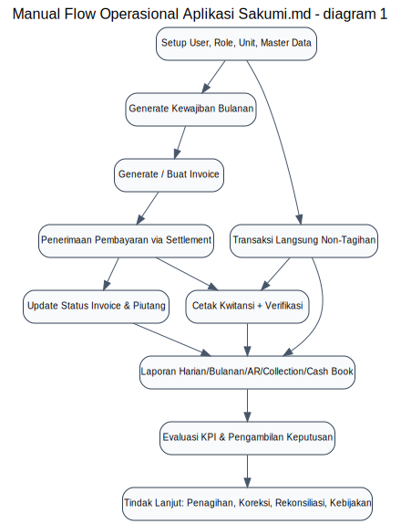

## OPERATIONAL_HANDBOOK.md
### operational_handbook_diagram_01
- SVG: [operational_handbook_diagram_01.svg](./operational_handbook_diagram_01.svg)
- PNG: [operational_handbook_diagram_01.png](./operational_handbook_diagram_01.png)
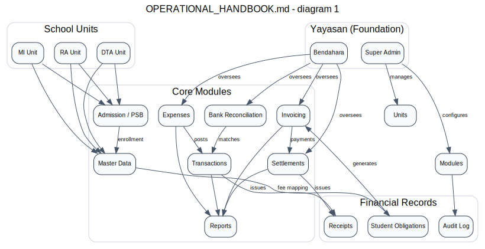
### operational_handbook_diagram_02
- SVG: [operational_handbook_diagram_02.svg](./operational_handbook_diagram_02.svg)
- PNG: [operational_handbook_diagram_02.png](./operational_handbook_diagram_02.png)

### operational_handbook_diagram_03
- SVG: [operational_handbook_diagram_03.svg](./operational_handbook_diagram_03.svg)
- PNG: [operational_handbook_diagram_03.png](./operational_handbook_diagram_03.png)
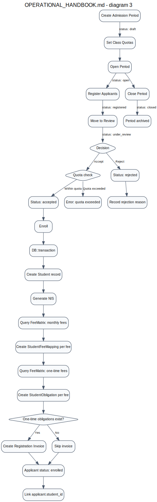
### operational_handbook_diagram_04
- SVG: [operational_handbook_diagram_04.svg](./operational_handbook_diagram_04.svg)
- PNG: [operational_handbook_diagram_04.png](./operational_handbook_diagram_04.png)
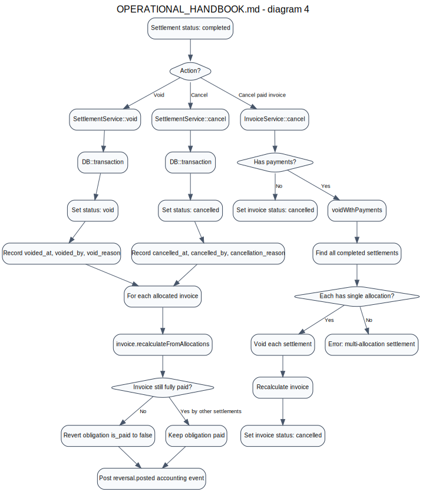
### operational_handbook_diagram_05
- SVG: [operational_handbook_diagram_05.svg](./operational_handbook_diagram_05.svg)
- PNG: [operational_handbook_diagram_05.png](./operational_handbook_diagram_05.png)
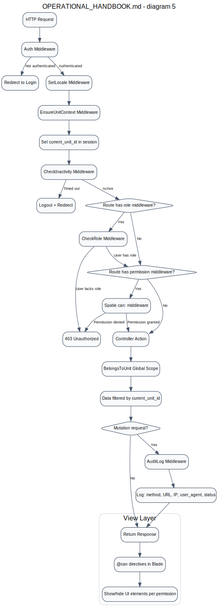
### operational_handbook_diagram_06
- SVG: [operational_handbook_diagram_06.svg](./operational_handbook_diagram_06.svg)
- PNG: [operational_handbook_diagram_06.png](./operational_handbook_diagram_06.png)
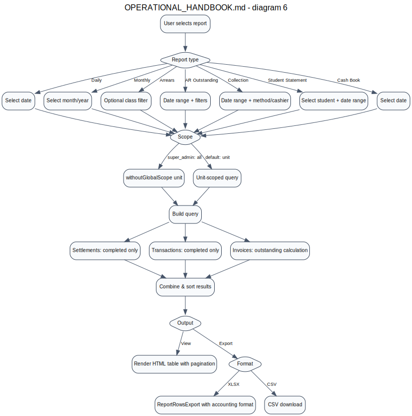
### operational_handbook_diagram_07
- SVG: [operational_handbook_diagram_07.svg](./operational_handbook_diagram_07.svg)
- PNG: [operational_handbook_diagram_07.png](./operational_handbook_diagram_07.png)
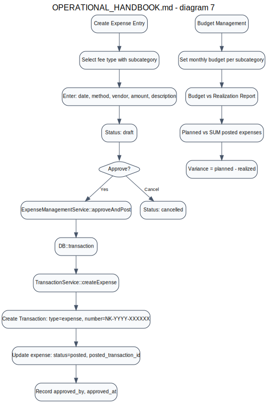
### operational_handbook_diagram_08
- SVG: [operational_handbook_diagram_08.svg](./operational_handbook_diagram_08.svg)
- PNG: [operational_handbook_diagram_08.png](./operational_handbook_diagram_08.png)
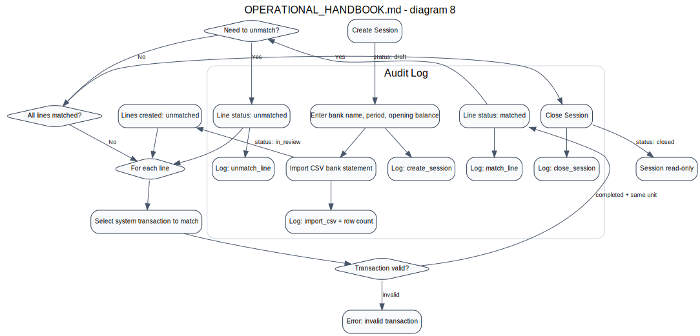

## OPERATIONAL_HANDBOOK_EN.md
### operational_handbook_en_diagram_01
- SVG: [operational_handbook_en_diagram_01.svg](./operational_handbook_en_diagram_01.svg)
- PNG: [operational_handbook_en_diagram_01.png](./operational_handbook_en_diagram_01.png)

### operational_handbook_en_diagram_02
- SVG: [operational_handbook_en_diagram_02.svg](./operational_handbook_en_diagram_02.svg)
- PNG: [operational_handbook_en_diagram_02.png](./operational_handbook_en_diagram_02.png)
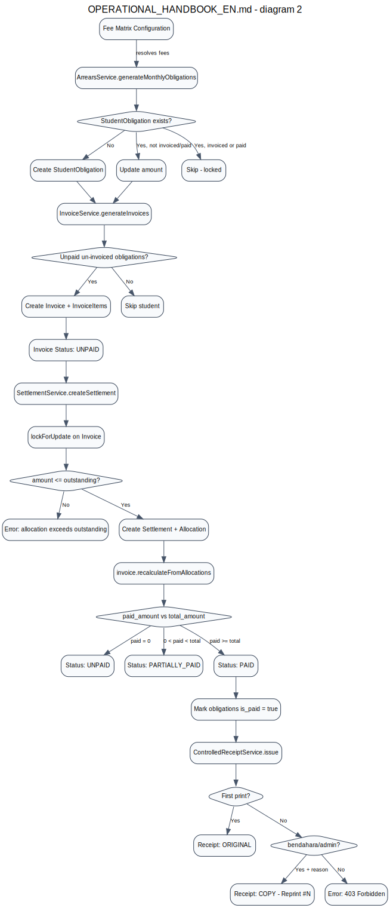
### operational_handbook_en_diagram_03
- SVG: [operational_handbook_en_diagram_03.svg](./operational_handbook_en_diagram_03.svg)
- PNG: [operational_handbook_en_diagram_03.png](./operational_handbook_en_diagram_03.png)
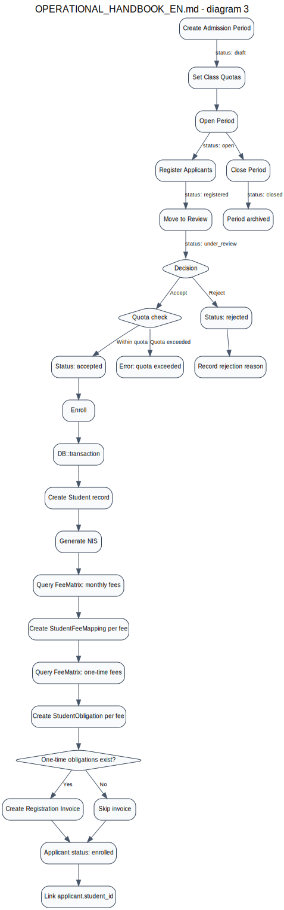
### operational_handbook_en_diagram_04
- SVG: [operational_handbook_en_diagram_04.svg](./operational_handbook_en_diagram_04.svg)
- PNG: [operational_handbook_en_diagram_04.png](./operational_handbook_en_diagram_04.png)
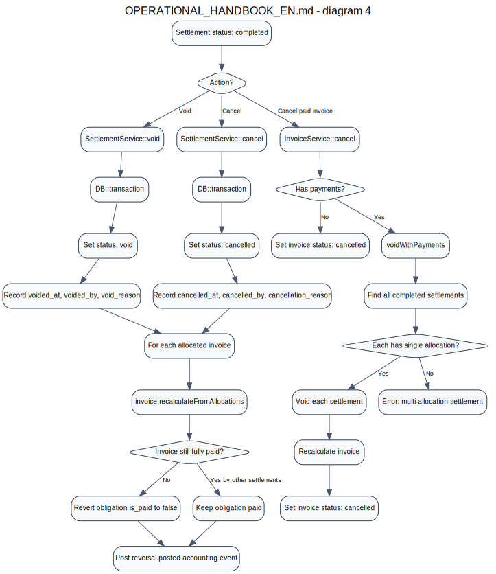
### operational_handbook_en_diagram_05
- SVG: [operational_handbook_en_diagram_05.svg](./operational_handbook_en_diagram_05.svg)
- PNG: [operational_handbook_en_diagram_05.png](./operational_handbook_en_diagram_05.png)
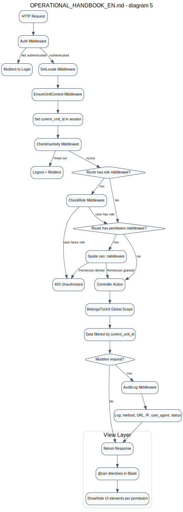
### operational_handbook_en_diagram_06
- SVG: [operational_handbook_en_diagram_06.svg](./operational_handbook_en_diagram_06.svg)
- PNG: [operational_handbook_en_diagram_06.png](./operational_handbook_en_diagram_06.png)
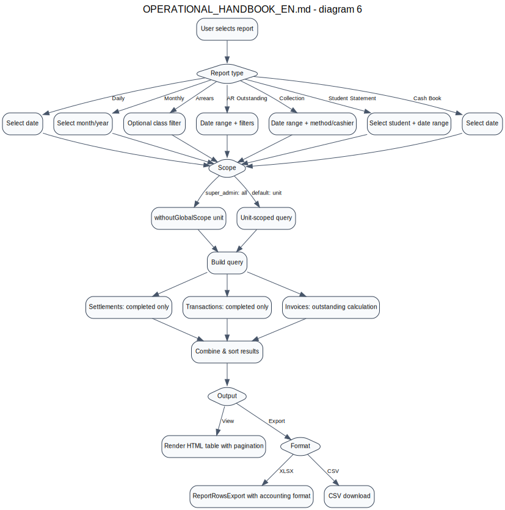
### operational_handbook_en_diagram_07
- SVG: [operational_handbook_en_diagram_07.svg](./operational_handbook_en_diagram_07.svg)
- PNG: [operational_handbook_en_diagram_07.png](./operational_handbook_en_diagram_07.png)
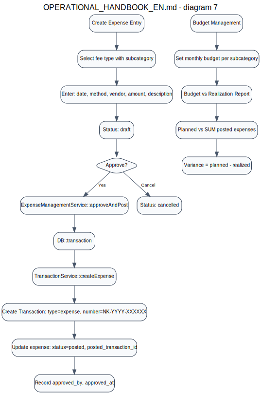
### operational_handbook_en_diagram_08
- SVG: [operational_handbook_en_diagram_08.svg](./operational_handbook_en_diagram_08.svg)
- PNG: [operational_handbook_en_diagram_08.png](./operational_handbook_en_diagram_08.png)


## OPERATIONAL_HANDBOOK_ID.md
### operational_handbook_id_diagram_01
- SVG: [operational_handbook_id_diagram_01.svg](./operational_handbook_id_diagram_01.svg)
- PNG: [operational_handbook_id_diagram_01.png](./operational_handbook_id_diagram_01.png)
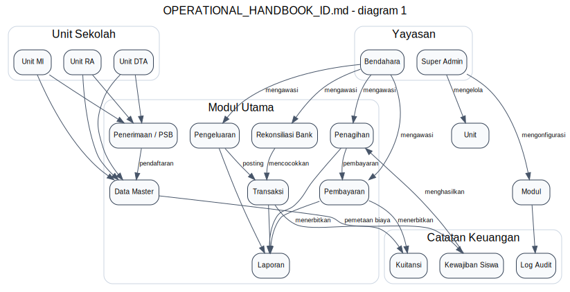
### operational_handbook_id_diagram_02
- SVG: [operational_handbook_id_diagram_02.svg](./operational_handbook_id_diagram_02.svg)
- PNG: [operational_handbook_id_diagram_02.png](./operational_handbook_id_diagram_02.png)
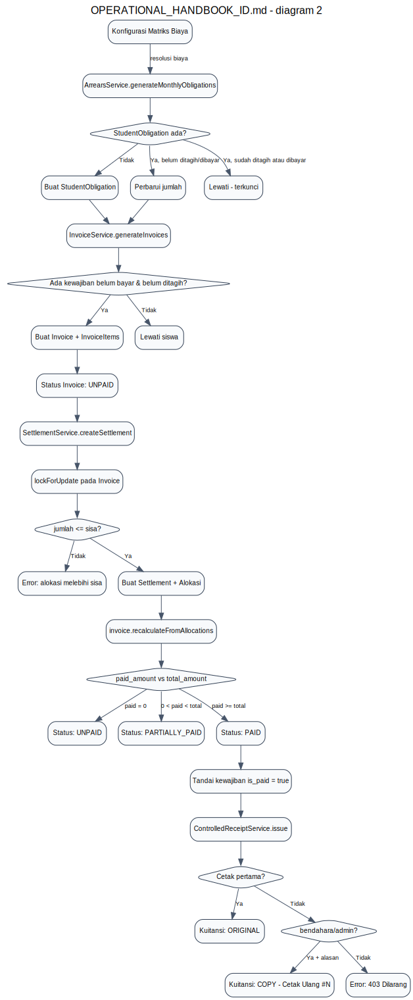
### operational_handbook_id_diagram_03
- SVG: [operational_handbook_id_diagram_03.svg](./operational_handbook_id_diagram_03.svg)
- PNG: [operational_handbook_id_diagram_03.png](./operational_handbook_id_diagram_03.png)
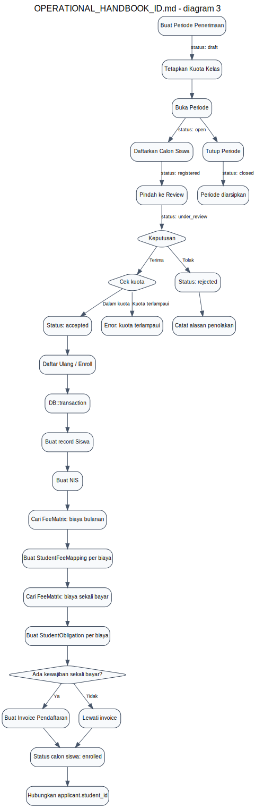
### operational_handbook_id_diagram_04
- SVG: [operational_handbook_id_diagram_04.svg](./operational_handbook_id_diagram_04.svg)
- PNG: [operational_handbook_id_diagram_04.png](./operational_handbook_id_diagram_04.png)
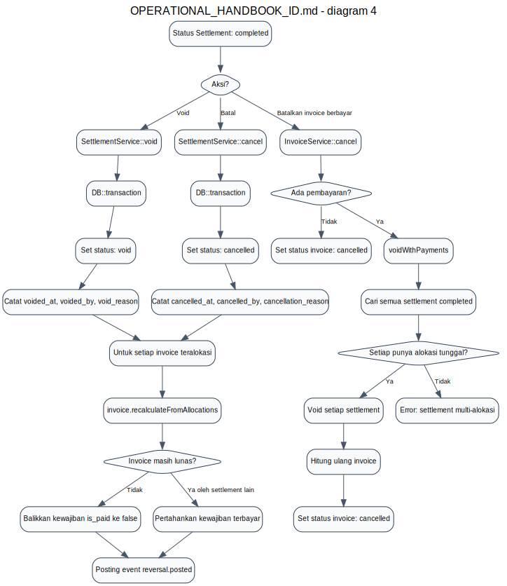
### operational_handbook_id_diagram_05
- SVG: [operational_handbook_id_diagram_05.svg](./operational_handbook_id_diagram_05.svg)
- PNG: [operational_handbook_id_diagram_05.png](./operational_handbook_id_diagram_05.png)
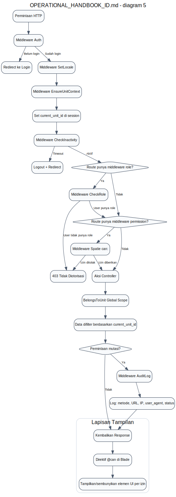
### operational_handbook_id_diagram_06
- SVG: [operational_handbook_id_diagram_06.svg](./operational_handbook_id_diagram_06.svg)
- PNG: [operational_handbook_id_diagram_06.png](./operational_handbook_id_diagram_06.png)
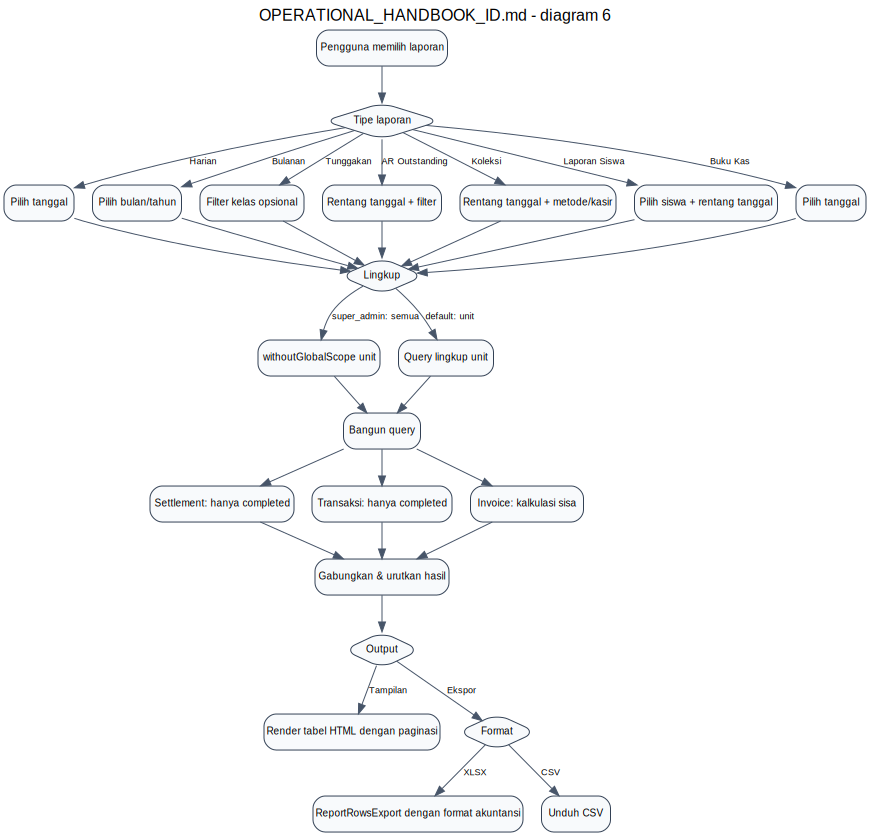
### operational_handbook_id_diagram_07
- SVG: [operational_handbook_id_diagram_07.svg](./operational_handbook_id_diagram_07.svg)
- PNG: [operational_handbook_id_diagram_07.png](./operational_handbook_id_diagram_07.png)
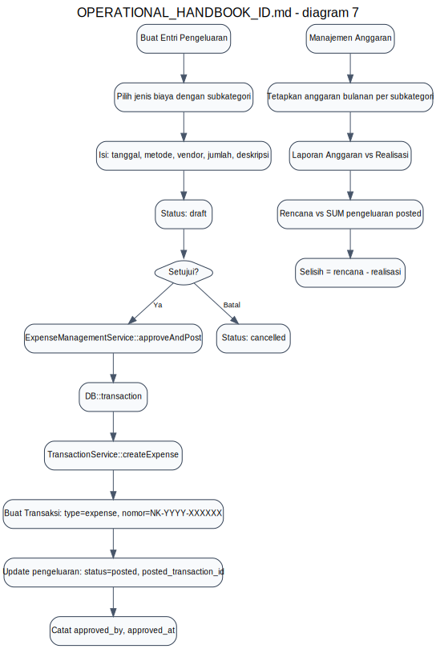
### operational_handbook_id_diagram_08
- SVG: [operational_handbook_id_diagram_08.svg](./operational_handbook_id_diagram_08.svg)
- PNG: [operational_handbook_id_diagram_08.png](./operational_handbook_id_diagram_08.png)
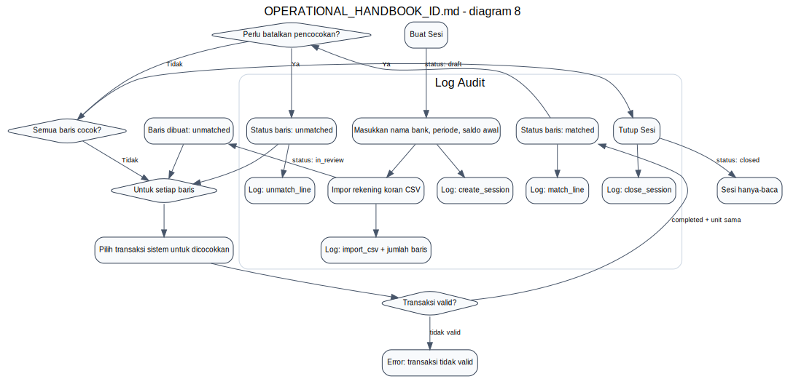

Regenerate:
```bash
python3 scripts/render_mermaid_flows.py
```
