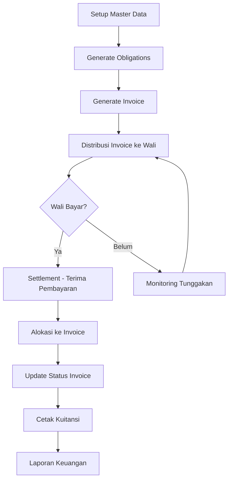
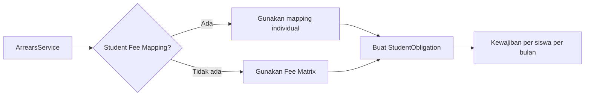
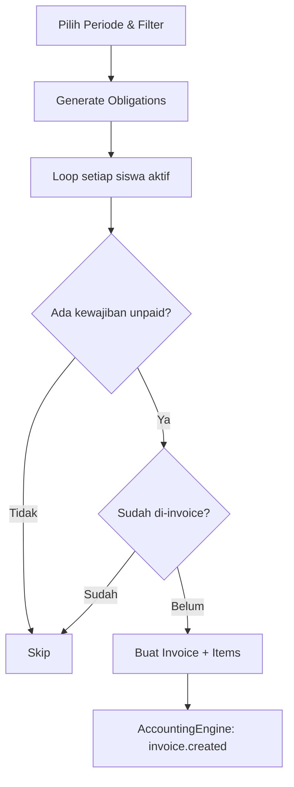
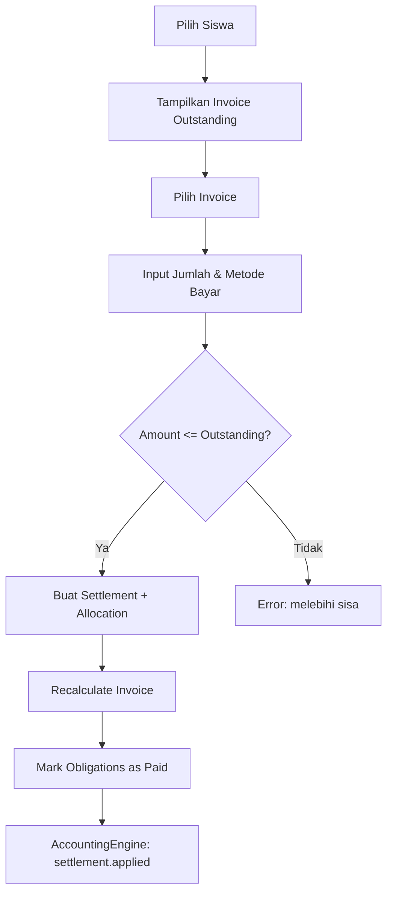
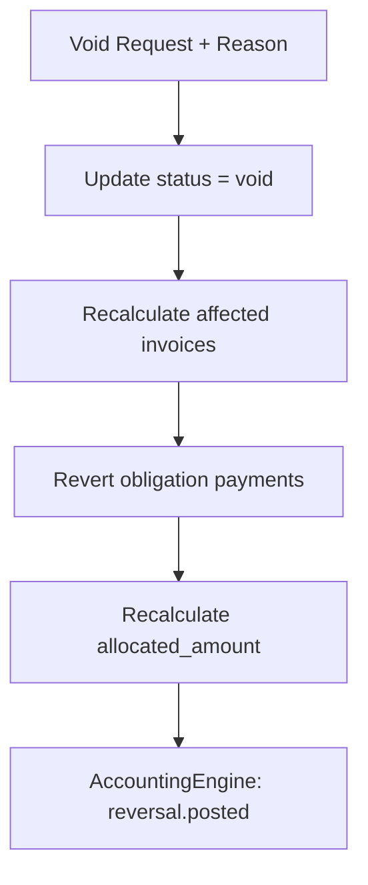
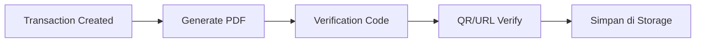
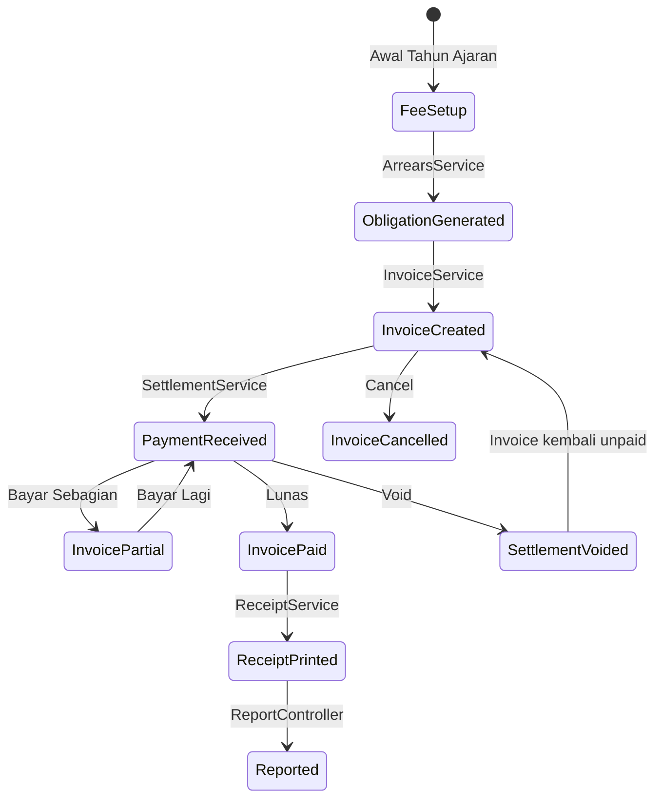

# SAKUMI - Business Process Flow

## Siklus Keuangan Lengkap

## 1. Setup Master Data (Awal Tahun Ajaran)

### Alur:
1. Admin TU mendaftarkan/mengupdate data siswa
2. Admin TU mengatur kelas dan kategori siswa
3. Bendahara mengatur jenis biaya (Fee Types)
4. Bendahara mengatur tarif per kelas/kategori (Fee Matrix)
5. Jika ada siswa dengan tarif khusus, buat Student Fee Mapping

### Data yang Dikelola:
- **Students** — NIS, NISN, nama, kelas, kategori, data wali
- **School Classes** — Kelas 1-6 (MI), kelompok A/B (RA), dll
- **Student Categories** — Reguler, yatim, dhuafa, dll
- **Fee Types** — SPP, uang gedung, kegiatan, dll (flag `is_monthly`)
- **Fee Matrix** — Tarif: fee_type × class × category = amount

## 2. Generate Kewajiban (Obligation)

### Alur:

### Mekanisme:
- `ArrearsService::generateMonthlyObligations()` berjalan otomatis saat invoice generation
- Mengecek enrollment aktif siswa pada tanggal periode
- Prioritas tarif: Student Fee Mapping > Fee Matrix (class+category > class > category > default)
- Idempoten — tidak membuat duplikat, tapi bisa update tarif selama belum pernah di-invoice

## 3. Invoice (Penagihan)

### Batch Generation:

### Manual Creation:
1. Pilih siswa
2. Sistem menampilkan kewajiban yang belum di-invoice
3. Pilih kewajiban yang ingin di-invoice
4. Set tanggal jatuh tempo
5. Invoice dibuat dengan nomor otomatis

### Status Invoice:
| Status | Keterangan |
|--------|------------|
| `unpaid` | Belum ada pembayaran |
| `partially_paid` | Sudah dibayar sebagian |
| `paid` | Lunas (paid_amount >= total_amount) |
| `cancelled` | Dibatalkan |

### Proteksi:
- Invoice tidak bisa di-hard delete (exception dilempar)
- Cancel invoice yang sudah ada pembayaran akan cascade void settlement terkait
- Membutuhkan permission `invoices.cancel_paid` untuk cancel invoice yang sudah dibayar

## 4. Settlement (Penerimaan Pembayaran)

### Single-Invoice Flow:

### Multi-Invoice Flow:
1. Pilih siswa
2. Tampilkan semua invoice outstanding
3. Input total pembayaran
4. Alokasikan ke masing-masing invoice
5. Validasi: total alokasi <= total pembayaran
6. Validasi: setiap alokasi <= outstanding invoice tersebut
7. Buat Settlement dengan multiple SettlementAllocation

### Concurrency Control:
- `lockForUpdate()` pada invoice saat alokasi untuk mencegah over-allocation
- Validasi outstanding dihitung dari allocation sum, bukan kolom `paid_amount`

### Void Settlement:

## 5. Transaction (Penerimaan/Pengeluaran Non-Invoice)

### Cash Separation Rules:
- Pembayaran siswa dengan fee bulanan **WAJIB** melalui Settlement
- Jika siswa punya invoice terbuka, sistem redirect ke Settlement
- Jika siswa punya kewajiban belum di-invoice, sistem tolak dan arahkan ke Invoice dulu
- Transaction hanya untuk penerimaan non-rutin atau pengeluaran

### Income Transaction:
- Untuk penerimaan yang tidak terkait invoice (donasi, dll)
- Otomatis generate receipt PDF

### Expense Transaction:
- Membutuhkan permission `transactions.expense.create`
- Fee type harus bertipe expense (dengan subcategory)

## 6. Receipt (Kuitansi)

### Flow:

### Controlled Receipt (Settlement):
1. Cetak pertama — otomatis, status ORIGINAL
2. Cetak ulang — wajib alasan, hanya bendahara/admin
3. Setiap cetak dicatat: user, waktu, IP, device, alasan

### Verifikasi:
- Setiap kuitansi punya verification code unik
- Bisa diverifikasi publik via URL tanpa login

## 7. Reporting

### Laporan yang Tersedia:

| Laporan | Fungsi | Export |
|---------|--------|--------|
| Daily | Transaksi harian | Excel |
| Monthly | Rekapitulasi bulanan | Excel |
| Arrears | Daftar tunggakan per siswa | Excel |
| AR Outstanding | Aging analysis piutang | Excel |
| Collection | Tingkat kolektabilitas | Excel |
| Student Statement | Riwayat keuangan siswa | Excel |
| Cash Book | Arus kas masuk/keluar | Excel |
| Budget vs Realization | Anggaran vs realisasi pengeluaran | - |

### Scope:
- Per unit (default) — hanya data unit aktif
- Consolidated (super_admin) — gabungan semua unit

## Diagram Lifecycle Lengkap

