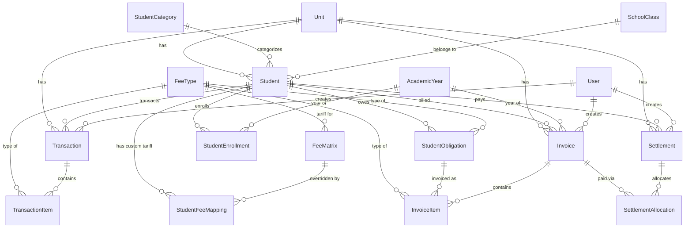
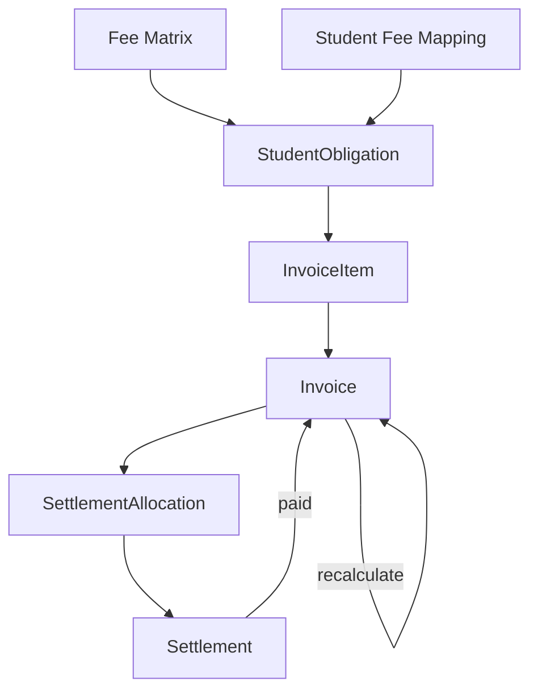
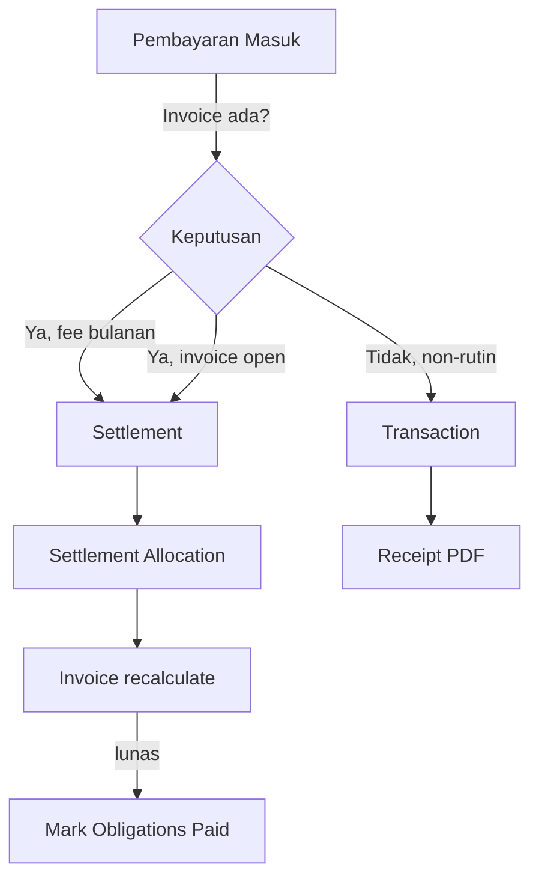
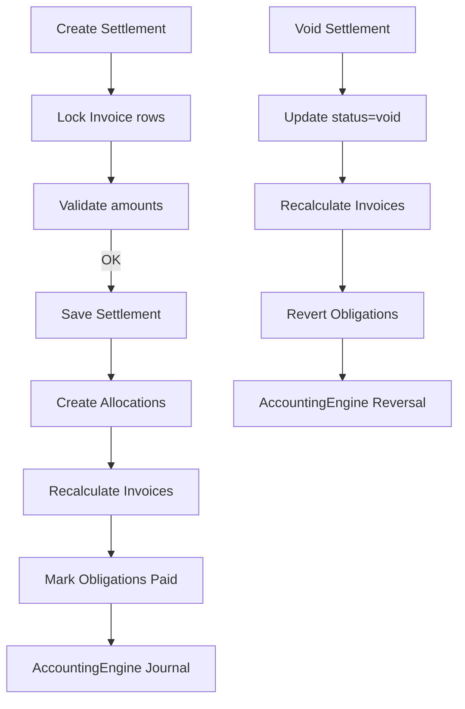
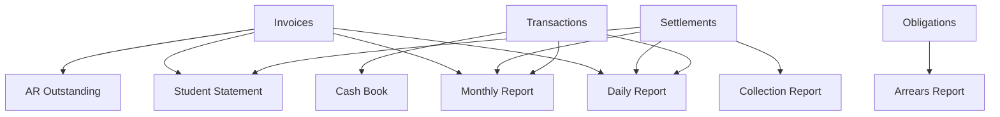
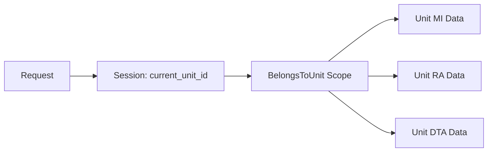

# SAKUMI - Data Flow

## 1. Entity Relationship

## 2. Data Models

### Student
| Field | Type | Keterangan |
|-------|------|------------|
| id | bigint | Primary key |
| unit_id | bigint | FK → units |
| nis | string | Nomor Induk Siswa |
| nisn | string | Nomor Induk Siswa Nasional |
| name | string | Nama lengkap |
| class_id | bigint | FK → classes |
| category_id | bigint | FK → student_categories |
| gender | string | L/P |
| birth_date | date | Tanggal lahir |
| birth_place | string | Tempat lahir |
| parent_name | string | Nama wali |
| parent_phone | string | No. HP wali |
| parent_whatsapp | string | No. WhatsApp wali |
| address | text | Alamat |
| status | string | active / inactive / graduated / etc |
| enrollment_date | date | Tanggal masuk |

**Relasi:**
- `belongsTo` SchoolClass, StudentCategory
- `hasMany` StudentEnrollment, StudentObligation, Invoice, Settlement, Transaction, StudentFeeMapping, Notification
- `hasOne` currentEnrollment (where is_current = true), Applicant

### Invoice
| Field | Type | Keterangan |
|-------|------|------------|
| id | bigint | Primary key |
| unit_id | bigint | FK → units (auto via scope) |
| academic_year_id | bigint | FK → academic_years (nullable) |
| invoice_number | string | Nomor unik (INV-UNIT-YEAR-SEQ) |
| student_id | bigint | FK → students |
| student_enrollment_id | bigint | FK → student_enrollments (nullable) |
| period_type | string | monthly / annual |
| period_identifier | string | 2026-03 / AY2026 |
| invoice_date | date | Tanggal invoice |
| due_date | date | Tanggal jatuh tempo |
| total_amount | decimal(2) | Total tagihan |
| paid_amount | decimal(2) | Jumlah terbayar (denormalized) |
| status | string | unpaid / partially_paid / paid / cancelled |
| notes | text | Catatan |
| created_by | bigint | FK → users |
| updated_by | bigint | FK → users |

**Computed:**
- `outstanding` = total_amount - paid_amount

**Proteksi:**
- Hard delete diblokir (throws RuntimeException)
- `recalculateFromAllocations()` menghitung ulang paid_amount dari settlement allocations

### Settlement
| Field | Type | Keterangan |
|-------|------|------------|
| id | bigint | Primary key |
| unit_id | bigint | FK → units |
| settlement_number | string | Nomor unik (STL-YEAR-SEQ) |
| student_id | bigint | FK → students |
| payment_date | date | Tanggal bayar |
| payment_method | string | cash / transfer / qris |
| total_amount | decimal(2) | Total uang diterima |
| allocated_amount | decimal(2) | Total dialokasikan (denormalized) |
| reference_number | string | Referensi bank (nullable) |
| notes | text | Catatan |
| status | string | completed / cancelled / void |
| created_by | bigint | FK → users |
| cancelled_at | datetime | Waktu cancel |
| cancelled_by | bigint | FK → users |
| cancellation_reason | text | Alasan cancel |
| voided_at | datetime | Waktu void |
| voided_by | bigint | FK → users |
| void_reason | text | Alasan void |
| updated_by | bigint | FK → users |

**Computed:**
- `unallocated` = total_amount - SUM(allocations.amount)

**Proteksi:**
- Hard delete diblokir
- `recalculateAllocatedAmount()` sync denormalized column (hanya non-completed)

### SettlementAllocation
| Field | Type | Keterangan |
|-------|------|------------|
| id | bigint | Primary key |
| settlement_id | bigint | FK → settlements |
| invoice_id | bigint | FK → invoices |
| amount | decimal(2) | Jumlah dialokasikan |

**Peran:**
- Tabel penghubung antara Settlement dan Invoice
- Satu settlement bisa alokasi ke banyak invoice
- Satu invoice bisa menerima dari banyak settlement

### Transaction
| Field | Type | Keterangan |
|-------|------|------------|
| id | bigint | Primary key |
| unit_id | bigint | FK → units |
| transaction_number | string | NF-YEAR-SEQ (income) / NK-YEAR-SEQ (expense) |
| transaction_date | date | Tanggal transaksi |
| type | string | income / expense |
| student_id | bigint | FK → students (nullable) |
| payment_method | string | cash / transfer / qris |
| total_amount | decimal | Total transaksi |
| description | text | Keterangan |
| status | string | completed / cancelled |
| created_by | bigint | FK → users |
| cancelled_at | datetime | Waktu cancel |
| cancelled_by | bigint | FK → users |
| cancellation_reason | text | Alasan cancel |

### StudentObligation
| Field | Type | Keterangan |
|-------|------|------------|
| id | bigint | Primary key |
| unit_id | bigint | FK → units |
| academic_year_id | bigint | FK → academic_years |
| student_id | bigint | FK → students |
| student_enrollment_id | bigint | FK → student_enrollments |
| class_id_snapshot | bigint | Kelas saat kewajiban dibuat |
| fee_type_id | bigint | FK → fee_types |
| month | int | Bulan (1-12) |
| year | int | Tahun |
| amount | decimal | Jumlah kewajiban |
| is_paid | boolean | Status terbayar |
| paid_amount | decimal | Jumlah terbayar |
| paid_at | datetime | Waktu pembayaran |
| transaction_item_id | bigint | FK → transaction_items (legacy) |

## 3. Data Flow Diagrams

### Invoice Flow

### Payment Flow

### Settlement Flow

### Reporting Flow

## 4. Multi-Tenant Data Isolation

- Setiap model menggunakan trait `BelongsToUnit` yang menambahkan global scope
- Data otomatis difilter berdasarkan `unit_id` dari session
- Super admin bisa melihat data consolidated (semua unit) di laporan
- Switch unit mengubah `current_unit_id` di session
