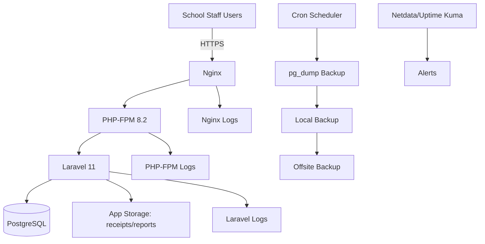
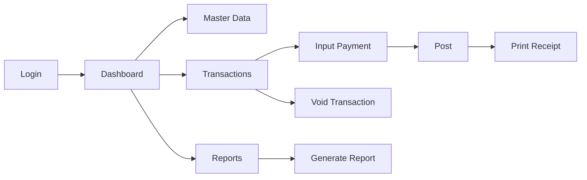

# Production Readiness & Operational Package
**Application:** SAKUMI

## 1) Production Architecture Overview
- Ubuntu VPS hosts Nginx, PHP-FPM 8.2, Laravel 11, and PostgreSQL.
- Nginx terminates TLS and proxies PHP requests to PHP-FPM.
- Laravel handles business logic, RBAC, reporting, receipt printing, and audit.
- PostgreSQL stores financial transactions and master data.
- Scheduled backups are stored locally and replicated offsite.
- Logs and monitoring are enabled at OS, web, app, and DB layers.



## 2) User Access & Credential Policy
### RBAC Matrix
| Capability | Super Admin | Operator TU | Bendahara | Kepala Sekolah | Auditor |
|---|---|---|---|---|---|
| Manage users/roles | Full | No | No | No | No |
| Input payment | Yes | Yes | Yes | No | No |
| Verify settlement | Yes | Draft only | Yes | View | View |
| Void transaction | Yes | Request only | Yes | No | No |
| Reports & dashboard | Full | Limited | Full | Executive | Read-only |
| View audit logs | Full | Own actions | Finance scope | Summary | Full read |

### Password & Login Rules
- Minimum 12 chars, upper/lower/number/symbol.
- Password rotation every 90 days.
- 5 failed attempts lockout (15 minutes).
- Session idle timeout 30 minutes.
- HTTPS-only login and rate-limiting.

### Provisioning Workflow
1. Access request submitted.
2. Super Admin validates role.
3. Account created with temporary password.
4. First login must force password change.
5. Provisioning action logged.

### Reset Workflow
1. User requests reset via helpdesk.
2. Identity verification.
3. Reset token/temp password issued.
4. User sets new password on next login.
5. Reset event logged.

## 3) SOP (Operational)
### SOP: Operator TU
1. Login.
2. Search/select student.
3. Input payment details.
4. Confirm nominal and category.
5. Save transaction.
6. Print receipt.
7. Submit daily summary.

### SOP: Bendahara
1. Login and open verification queue.
2. Validate payment entries.
3. Approve/reject with notes.
4. Finalize daily transactions.
5. Process void requests with reason.
6. Generate and archive daily report.

### SOP: Kepala Sekolah
1. Login to executive dashboard.
2. Review daily collection and arrears.
3. Review anomalies and exceptions.
4. Approve/sign off daily report.

## 4) JUKNIS (Technical User Guide)
### Login
1. Open production URL.
2. Enter credentials.
3. Complete MFA if enabled.

### Register Student
1. `Master Data > Students > Add`.
2. Fill required fields (NISN, Name, Class, Unit, Academic Year).
3. Save and verify in list.

### Input Payment
1. `Transactions > Payments`.
2. Select student and category.
3. Enter amount/date/method.
4. Save and print receipt.

### Void Transaction
1. Open transaction detail.
2. Click `Void`.
3. Enter mandatory reason.
4. Confirm and submit.

### Generate Reports
1. `Reports`.
2. Choose report type and period.
3. Generate and export PDF/Excel.

### Print Receipt
1. Open posted transaction.
2. Click `Print Receipt`.
3. Validate receipt number and amount.



## 5) JUKLAK (Operational Policy)
- Financial transactions cannot be hard-deleted.
- Corrections must use void + replacement transaction.
- Void requires reason and authorized role.
- All critical actions must be audit logged.
- Data modification restricted by role and period lock.

## 6) Initial Data Setup
- [ ] Academic year active.
- [ ] School units configured.
- [ ] Payment categories configured.
- [ ] Chart of accounts configured.
- [ ] User accounts created by role.
- [ ] Document numbering configured.
- [ ] Opening balances validated.

## 7) Backup Strategy
### Policy
- Daily full DB backup.
- Weekly compressed archive.
- Offsite replication.
- Restore drill at least monthly.

### Example Commands
```bash
pg_dump -h 127.0.0.1 -U sakumi_user -d sakumi_prod \
  -F c -b -v -f /var/backups/sakumi/sakumi_$(date +%F).dump

gzip -f /var/backups/sakumi/sakumi_$(date +%F).dump

pg_restore -h 127.0.0.1 -U sakumi_user -d sakumi_restore -v \
  /var/backups/sakumi/sakumi_2026-03-05.dump
```

## 8) Monitoring & Alerting
- Monitor CPU, RAM, disk, DB status, Nginx status, Laravel errors.
- Tools: Netdata (host metrics), Uptime Kuma (endpoint and TLS uptime).
- Alerts: email/Telegram with escalation if unresolved >30 minutes.

## 9) Security Hardening
- [ ] SSH key auth only.
- [ ] Root login disabled.
- [ ] Password SSH disabled.
- [ ] UFW active (`22`, `80`, `443`).
- [ ] Fail2ban active.
- [ ] HTTPS SSL valid and auto-renewed.
- [ ] Nginx login rate limit enabled.
- [ ] Routine patching and secret hygiene.

## 10) Logging & Audit Trail
Mandatory logs:
- Login success/failure.
- Transaction create/update/void.
- Data changes with before/after snapshot.
- Admin actions (roles, users, settings).
- Void actions with reason and approver.

## 11) Incident Response Runbook
### Scenarios
1. **Server down:** check provider, reboot, validate `nginx/php-fpm/postgresql`, smoke test.
2. **DB failure:** validate env, service status, credentials, connections, restart if needed.
3. **App error:** check Laravel/Nginx/PHP-FPM logs, clear cache, rollback if regression.
4. **User cannot login:** check lock status, role, failed attempts, reset credentials.
5. **Wrong transaction input:** void with reason, re-input correct transaction, verify audit.
6. **Backup restore:** restore in staging first, integrity checks, controlled prod restore.

## 12) Support & Helpdesk Procedure
### Workflow
1. User reports issue.
2. Ticket logging and categorization.
3. Priority assignment (`P1/P2/P3`).
4. L1 handling and L2 escalation if needed.
5. User update + resolution confirmation.

### Bug Report Template
```text
Ticket ID:
Reporter:
Role:
Date/Time:
Module:
Issue Summary:
Steps to Reproduce:
Expected Result:
Actual Result:
Evidence (screenshot/log):
Impact:
```

## 13) Go-Live Checklist
- [ ] Multi-role login tests passed.
- [ ] Payment and settlement flow tested.
- [ ] Report generation validated.
- [ ] Receipt printing validated.
- [ ] Backup + restore test passed.
- [ ] Monitoring + alert channels verified.
- [ ] Security baseline completed.
- [ ] Audit trail validation completed.

## 14) Post Go-Live Monitoring (First 2 Weeks)
- Daily health checks (uptime, errors, backup results).
- Daily reconciliation checks with Bendahara.
- Ticket trend review and hotfix prioritization.
- End of week 2 stabilization report.

## 15) Recommended Documentation Structure
```text
docs/
├── production-package/
│   ├── README.md
│   ├── en/
│   │   └── PRODUCTION_READINESS_PACKAGE.md
│   └── id/
│       └── PAKET_KESIAPAN_PRODUKSI.md
├── SOP/
├── RUNBOOK/
├── ADMIN_GUIDE/
└── BACKUP_GUIDE/
```
