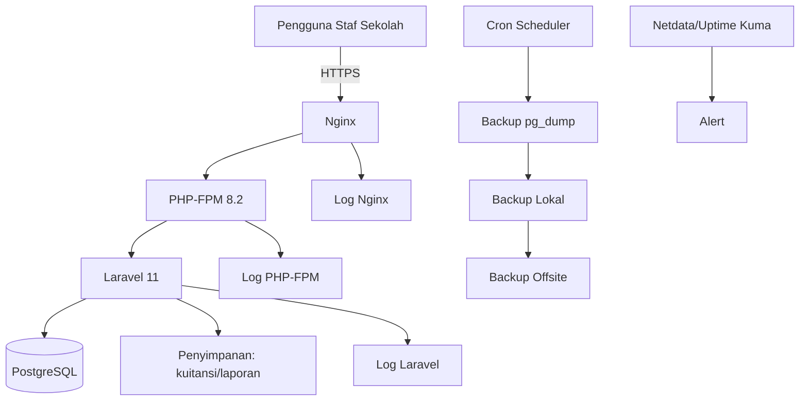
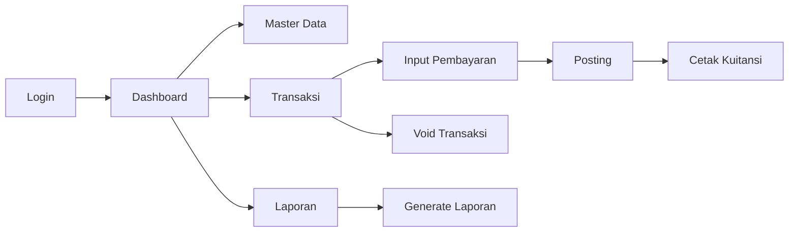

# Paket Kesiapan Produksi & Operasional
**Aplikasi:** SAKUMI

## 1) Ikhtisar Arsitektur Produksi
- VPS Ubuntu menjalankan Nginx, PHP-FPM 8.2, Laravel 11, dan PostgreSQL.
- Nginx menangani TLS dan meneruskan request PHP ke PHP-FPM.
- Laravel menangani logika bisnis, RBAC, laporan, cetak kuitansi, dan audit.
- PostgreSQL menyimpan data master dan transaksi keuangan.
- Backup terjadwal disimpan lokal lalu direplikasi ke offsite.
- Logging dan monitoring aktif pada level OS, web server, aplikasi, dan database.



## 2) Kebijakan Akses Pengguna & Kredensial
### Matriks RBAC
| Kapabilitas | Super Admin | Operator TU | Bendahara | Kepala Sekolah | Auditor |
|---|---|---|---|---|---|
| Kelola user/role | Penuh | Tidak | Tidak | Tidak | Tidak |
| Input pembayaran | Ya | Ya | Ya | Tidak | Tidak |
| Verifikasi settlement | Ya | Draft saja | Ya | Lihat | Lihat |
| Void transaksi | Ya | Ajukan | Ya | Tidak | Tidak |
| Laporan & dashboard | Penuh | Terbatas | Penuh | Eksekutif | Baca saja |
| Akses audit log | Penuh | Aksi sendiri | Lingkup keuangan | Ringkasan | Baca penuh |

### Aturan Password & Login
- Minimal 12 karakter, wajib huruf besar/kecil/angka/simbol.
- Rotasi password setiap 90 hari.
- Lockout setelah 5 gagal login (15 menit).
- Session timeout 30 menit idle.
- Login wajib HTTPS dan rate-limiting aktif.

### Alur Provisioning Akun
1. Permintaan akses diajukan.
2. Super Admin validasi role.
3. Akun dibuat dengan password sementara.
4. Login pertama wajib ganti password.
5. Aktivitas provisioning dicatat.

### Alur Reset Password
1. User ajukan reset via helpdesk.
2. Verifikasi identitas.
3. Token reset/password sementara diberikan.
4. User set password baru saat login berikutnya.
5. Event reset dicatat ke audit.

## 3) SOP Operasional
### SOP: Operator TU
1. Login.
2. Cari/pilih siswa.
3. Input detail pembayaran.
4. Konfirmasi nominal dan kategori.
5. Simpan transaksi.
6. Cetak kuitansi.
7. Serahkan rekap harian.

### SOP: Bendahara
1. Login dan buka antrean verifikasi.
2. Validasi entri pembayaran.
3. Setujui/tolak dengan catatan.
4. Finalisasi transaksi harian.
5. Proses void dengan alasan.
6. Generate dan arsipkan laporan harian.

### SOP: Kepala Sekolah
1. Login ke dashboard eksekutif.
2. Tinjau penerimaan harian dan tunggakan.
3. Tinjau anomali/pengecualian.
4. Beri paraf/persetujuan laporan harian.

## 4) JUKNIS (Panduan Teknis Pengguna)
### Login
1. Buka URL produksi.
2. Masukkan kredensial.
3. Selesaikan MFA jika aktif.

### Registrasi Siswa
1. `Master Data > Students > Add`.
2. Isi field wajib (NISN, Nama, Kelas, Unit, Tahun Ajaran).
3. Simpan dan verifikasi di daftar.

### Input Pembayaran
1. `Transactions > Payments`.
2. Pilih siswa dan kategori.
3. Isi nominal/tanggal/metode.
4. Simpan dan cetak kuitansi.

### Void Transaksi
1. Buka detail transaksi.
2. Klik `Void`.
3. Isi alasan wajib.
4. Konfirmasi dan submit.

### Generate Laporan
1. Buka menu `Reports`.
2. Pilih jenis laporan dan periode.
3. Generate lalu ekspor PDF/Excel.

### Cetak Kuitansi
1. Buka transaksi berstatus posted.
2. Klik `Print Receipt`.
3. Validasi nomor kuitansi dan nominal.



## 5) JUKLAK (Kebijakan Operasional)
- Transaksi keuangan tidak boleh dihapus permanen.
- Koreksi dilakukan dengan void + input transaksi pengganti.
- Void wajib alasan dan role berwenang.
- Semua aksi kritikal wajib tercatat di audit log.
- Modifikasi data dibatasi role dan lock periode.

## 6) Setup Data Awal
- [ ] Tahun ajaran aktif.
- [ ] Unit sekolah terkonfigurasi.
- [ ] Kategori pembayaran terkonfigurasi.
- [ ] Chart of Accounts terkonfigurasi.
- [ ] Akun user per role sudah dibuat.
- [ ] Penomoran dokumen dikonfigurasi.
- [ ] Saldo awal tervalidasi.

## 7) Strategi Backup
### Kebijakan
- Backup penuh database harian.
- Arsip mingguan terkompresi.
- Replikasi backup ke offsite.
- Uji restore minimal bulanan.

### Contoh Perintah
```bash
pg_dump -h 127.0.0.1 -U sakumi_user -d sakumi_prod \
  -F c -b -v -f /var/backups/sakumi/sakumi_$(date +%F).dump

gzip -f /var/backups/sakumi/sakumi_$(date +%F).dump

pg_restore -h 127.0.0.1 -U sakumi_user -d sakumi_restore -v \
  /var/backups/sakumi/sakumi_2026-03-05.dump
```

## 8) Monitoring & Alerting
- Pantau CPU, RAM, disk, status DB, status Nginx, error Laravel.
- Tools: Netdata (metrik server), Uptime Kuma (uptime endpoint/TLS).
- Alert ke email/Telegram, eskalasi jika >30 menit belum selesai.

## 9) Security Hardening
- [ ] SSH key auth saja.
- [ ] Root login nonaktif.
- [ ] SSH password nonaktif.
- [ ] UFW aktif (`22`, `80`, `443`).
- [ ] Fail2ban aktif.
- [ ] HTTPS SSL valid dan auto-renew.
- [ ] Rate limit login di Nginx aktif.
- [ ] Patch rutin dan hygiene secret.

## 10) Logging & Audit Trail
Log wajib:
- Login sukses/gagal.
- Transaksi create/update/void.
- Perubahan data dengan snapshot before/after.
- Aktivitas admin (role, user, settings).
- Aksi void beserta alasan dan approver.

## 11) Runbook Respons Insiden
### Skenario
1. **Server down:** cek provider, reboot, validasi `nginx/php-fpm/postgresql`, smoke test.
2. **DB gagal konek:** cek env, status service, kredensial, koneksi, restart jika perlu.
3. **Error aplikasi:** cek log Laravel/Nginx/PHP-FPM, clear cache, rollback jika regresi.
4. **User gagal login:** cek lock akun, role, gagal login, reset kredensial.
5. **Salah input transaksi:** void dengan alasan, input ulang benar, cek audit.
6. **Restore backup:** restore di staging dulu, uji integritas, restore produksi terkontrol.

## 12) Prosedur Support & Helpdesk
### Alur
1. User melaporkan masalah.
2. Ticket dicatat dan dikategorikan.
3. Tetapkan prioritas (`P1/P2/P3`).
4. Penanganan L1 dan eskalasi ke L2 bila perlu.
5. Update user + konfirmasi penyelesaian.

### Template Bug Report
```text
Ticket ID:
Pelapor:
Role:
Tanggal/Jam:
Modul:
Ringkasan Masalah:
Langkah Reproduksi:
Hasil Diharapkan:
Hasil Aktual:
Bukti (screenshot/log):
Dampak:
```

## 13) Checklist Go-Live
- [ ] Uji login multi-role lolos.
- [ ] Alur pembayaran dan settlement lolos.
- [ ] Generate laporan tervalidasi.
- [ ] Cetak kuitansi tervalidasi.
- [ ] Uji backup + restore lolos.
- [ ] Monitoring + alert channel tervalidasi.
- [ ] Baseline keamanan terpenuhi.
- [ ] Validasi audit trail selesai.

## 14) Monitoring Pasca Go-Live (2 Minggu Pertama)
- Cek harian kesehatan sistem (uptime, error, hasil backup).
- Cek rekonsiliasi harian bersama Bendahara.
- Review tren tiket dan prioritas hotfix.
- Laporan stabilisasi akhir minggu ke-2.

## 15) Struktur Folder Dokumentasi Rekomendasi
```text
docs/
├── production-package/
│   ├── README.md
│   ├── en/
│   │   └── PRODUCTION_READINESS_PACKAGE.md
│   └── id/
│       └── PAKET_KESIAPAN_PRODUKSI.md
├── SOP/
├── RUNBOOK/
├── ADMIN_GUIDE/
└── BACKUP_GUIDE/
```
